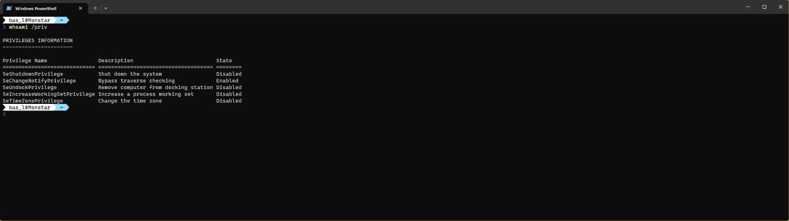
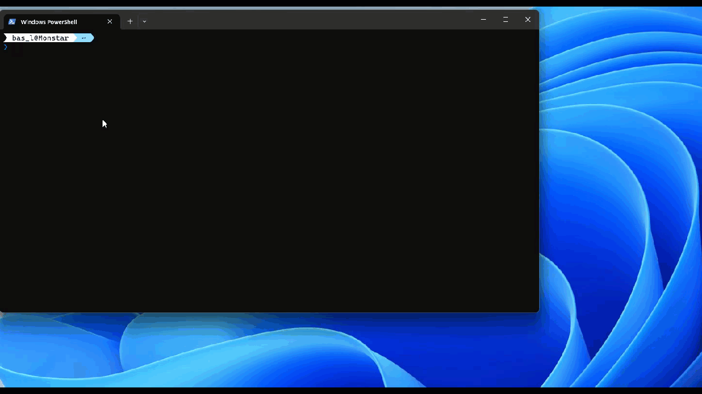
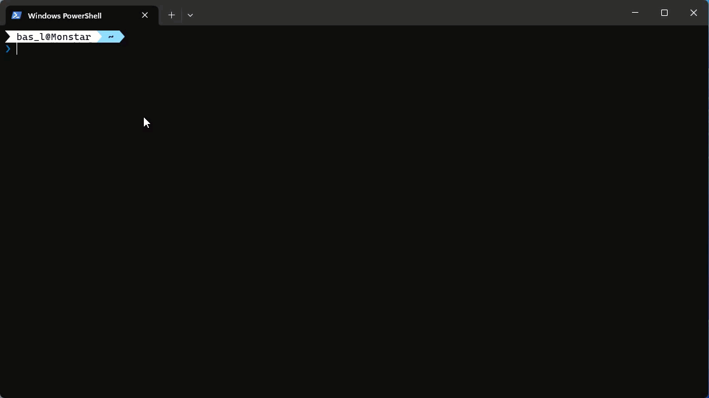

For the platform that I often work with, it is required that some tasks are run with administrative privileges. I often forget to open my windows terminal with admin privileges, or to open vscode with admin privileges. Aside from forgetting it, I dislike that from a security perspective as well. Windows terminal, however, does support to open a new console with administrative privileges, however, this will end up into a new windows terminal being opened, I'd rather open a new tab with the same privileges. In the end it is even possible to run a regular shell and elevated shell side by side. This blogpost explains how to do this.



## required software - gsudo

In orde to make this possible, a handy tool needs to be installed, called [gsudo](https://github.com/gerardog/gsudo). 

> `Gsudo` is a `sudo` equivalent for windows. equivalent for Windows, with a similar user-experience as the original Unix/Linux sudo. Allows to run commands with elevated permissions, or to elevate the current shell, in the current console window or a new one.

The quote ```elevate the current shell``` is where the power of this tool lies. using ```gsudo powershell``` the elevated console can be opened. And the cool part, it is not strictly bound to only powershell, but `bash`, `cmd` and other shells can be run under elevated privileges as well!

This tool can easily be installed with the following command:

```powershell
winget install gerardog.gsudo
```

## How to add the tab with administrator privileges

After installation of this tool, the next step is to configure Windows terminal to add a configuration with the administrator privileges





## Open in split pane view


## Summary