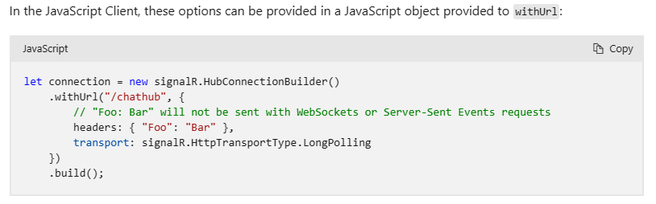

My [previous blogpost](../set-signalr-userid-without-authentication) appeared to be a bit outdated and contained not the most recent information. I stated that custom headers couldn't be used with the SignalR ConnectionHubBuilder (at least, the headers got ignored in older versions), but this isn't the case with more recent ConnectionHubBuilder anymore.

> I like the use of a custom header to provide the userID more than the querystring approach, as this querystring might appear in browserhistory and logs, this is less the case with custom headers.

The withUrl method does have an optional `IHttpConnectionOptions` parameter, which has a [few properties](https://learn.microsoft.com/en-us/javascript/api/@microsoft/signalr/ihttpconnectionoptions?view=signalr-js-latest), with one of them being the `headers?: MessageHeaders`. A reference can still be found [in the documentation](https://learn.microsoft.com/en-us/aspnet/core/signalr/configuration?view=aspnetcore-5.0&tabs=javascript#configure-client-options-1) (last javascript example):



The headers could be set explicitly, but for some reason, custom headers were not added. a few versions ago (I really don't know what version) this was fixed. With the javascript below, the custom headers can be send (and thus, the UserID can be provided via a custom header).

```javascript
let messages = document.querySelector('#messages')
const apiBaseUrl = window.location.origin
const headers = { userid: 'bas' }
const connection = new signalR.HubConnectionBuilder()
  .withUrl(apiBaseUrl + '/api', { headers })
  .configureLogging(signalR.LogLevel.Information)
  .build()
```

Accordingly, the azure negotiate function needs to be changed as well:

```csharp
[FunctionName("negotiate")]
public static SignalRConnectionInfo Negotiate(
    [HttpTrigger(AuthorizationLevel.Anonymous)]HttpRequest req,
    [SignalRConnectionInfo(HubName = "chat", UserId = "{headers.userid}")]SignalRConnectionInfo connectionInfo)
{
    // connectionInfo contains an access key token with a name identifier claim set to the identified user
    return connectionInfo;
}
```
