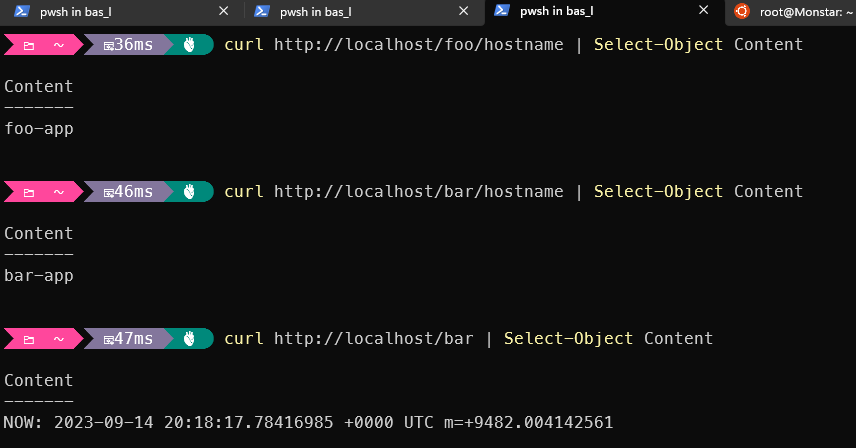
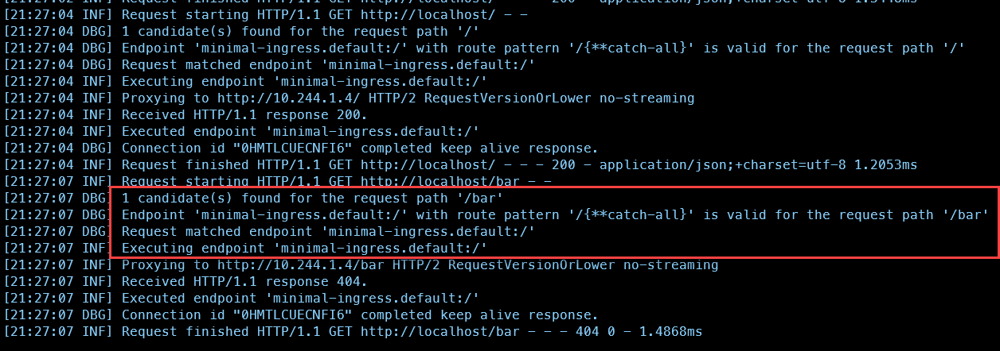
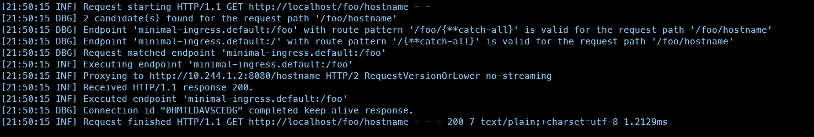
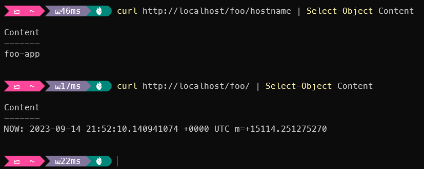

In my [previous blogpost](../why-to-choose-yarp-for-a-sitecore-migration/) I described why I am considering to use this [Yarp](https://microsoft.github.io/reverse-proxy/) (Yet another Reverse Proxy) (and a reverse proxy in general) instead of more standard ingress-controllers like HAProxy, Nginx or Traefik for a websites migration usecase. In this blogpost I will explain how I got it to work with Kubernetes in Docker Desktop (KinD).  While it is a very accessible and fast way to run Kubernetes on your local machine, it is not always easy to get things to work. Easy for more people who are experienced with Docker and Kubernetes, but for me it was a real discovery tour.

## Setup

The following setup was used: [Kubernetes in Docker Desktop](https://kind.sigs.k8s.io/) (KinD) based on the [quick start guide](https://kind.sigs.k8s.io/docs/user/quick-start/), a multi-node setup with one control-plane and two worker-nodes, to be specific.

```yaml
# three node (two workers) cluster config
kind: Cluster
apiVersion: kind.x-k8s.io/v1alpha4
nodes:
- role: control-plane
- role: worker
- role: worker
```

I learned quickly that on the windows ecosystem, the kubernetes cluster is not accessible from the host machine. While this might be solved with port-forwarding, this is not the most convenient solution. This is where exposing the ingress-controller comes in. By forwarding ports from  the host to an ingress controller, the services behind it can easily be accessed via the ingress controller. The kind [user guide for ingress](https://kind.sigs.k8s.io/docs/user/ingress/) has three examples on how to do this with Contour, Kong and NGINX, but not with Yarp. To be sure that the examples worked, the NGNIX example was tested, and indeed, it worked. A small change to the multi-node cluster configuration, was required, though:

```yaml
kind: Cluster
apiVersion: kind.x-k8s.io/v1alpha4
nodes:
- role: control-plane
  kubeadmConfigPatches:
  - |
    kind: InitConfiguration
    nodeRegistration:
      kubeletExtraArgs:
        node-labels: "ingress-ready=true"
  extraPortMappings:
  - containerPort: 80
    hostPort: 80
    protocol: TCP
  - containerPort: 443
    hostPort: 443
    protocol: TCP
- role: worker
- role: worker
```

## Ingress example based on NGINX

In the example, two services are created (foo and bar) and based on the path, the ingress controller routes traffic to the correct service. Both services, foo and bar, return datetime.now, except on /(foo|bar)/hostname, where the hostname is returned.

```yaml{6,12,19}
apiVersion: networking.k8s.io/v1
kind: Ingress
metadata:
  name: example-ingress
  annotations:
    nginx.ingress.kubernetes.io/rewrite-target: /$2
spec:
  rules:
  - http:
      paths:
      - pathType: Prefix
        path: /foo(/|$)(.*)
        backend:
          service:
            name: foo-service
            port:
              number: 8080
      - pathType: Prefix
        path: /bar(/|$)(.*)
        backend:
          service:
            name: bar-service
            port:
              number: 8080
```

After applying the example-ingress, both service were accessible via the ingress. Due to the regexp in the ingress-rule and the annotation to rewrite the target /foo/hostname (or /bar/hostname) will be transformed into /hostname for the specific service, which will result in the following responses:



My goal in this blogpost: rebuild the same functionality, except with Yarp as the reverse proxy!

## First Question: Can Yarp be used as an ingress controller?

My first thought, while overthinking this problem, was: This is never going to work. Although Yarp is pluggable, extensible, configurable, all I knew was that it was a "normal" process which could run as a reverse proxy. I never heard about Yarp running on kubernetes as an ingress controller, and I doubt if i were able to get it to work as an ingress controller. Guess what? On the [Yarp github repository](https://github.com/microsoft/reverse-proxy/) there is a Kubernetes.Controller [in the sourcefolder](https://github.com/microsoft/reverse-proxy/tree/main/src/Kubernetes.Controller) which seems to be actively maintained. There is even documentation which can be found [here](https://github.com/microsoft/reverse-proxy/blob/main/docs/docfx/articles/kubernetes-ingress.md) and [here (samples)](https://github.com/microsoft/reverse-proxy/tree/main/samples/KubernetesIngress.Sample)

## Yes we can! You gotta build it to run it!

There is currently no official docker image for yarp. Not that bad, building it doesn't bring too many problems. The [getting started article](https://github.com/microsoft/reverse-proxy/blob/main/docs/docfx/articles/kubernetes-ingress.md), is not accurate, but luckily there is a samples directory which has a lot of information as well. These samples supply two variations of the ingress controller:

1. Combined: Ingress controller which monitors the ingress resources and updates the configuration of the proxy
2. Separate monitor with controller. The Ingress monitor monitors the ingress resources and the ingress controller retrieves the configuration from the monitor. for sake of simplicity, the combined version is choice number one for this small piece of research.

From the root of the repository, run the following command, in order to build the controller:

```bash
docker build . -t xxx.azurecr.io/yarp-combined:latest -f ./samples/KubernetesIngress.Sample/Combined/Dockerfile
docker push image xxx.azurecr.io/yarp-combined:latest
```

Next, the backend has to be build:

```bash
docker build -t xxx.azurecr.io/backend:latest -f ./samples/KubernetesIngress.Sample/backend/Dockerfile .
docker push image xxx.azurecr.io/backend:latest
```

If all goes well, the images are ready to be used! This is where it got a bit harder (for me)

## Deployment

As there are no public images available, the definitions provided have to be (slightly) altered, in order to supply what images should be pulled and (in some cases) the imagepull secret should be specified. Microsoft has written [excellent documentation](https://learn.microsoft.com/en-us/azure/container-registry/container-registry-auth-kubernetes) how to create one for Azure Container Registry.

run the the following commands to deploy everything:

```bash
kubectl apply -f ./samples/KubernetesIngress.Sample/backend/backend.yaml
kubectl apply -f ./samples/KubernetesIngress.Sample/Combined/ingress-controller.yaml
```

## Happy Ingress!

YOU WISH! While the ingress controller is running, it is not accesible from the host, at this point. Various actions are needed to solve this. Following the ingress guide, the control-plane had a node-label ```node-labels: "ingress-ready=true"``` and through the ```extraPortMappings``` property, the ports 80 and 443 were exposed. This would make the ingress controller accessible from the host machine.

After deploying the yarp-controller, it showed up on one of the workers. With an exposed port on the controle-plane, this was never going to work. As I expected that the node-label ```node-labels: "ingress-ready=true"``` was used to be able to push the nginx controller to the controle-plane, I decided to look at the [nginx definition for kind](https://raw.githubusercontent.com/kubernetes/ingress-nginx/main/deploy/static/provider/kind/deploy.yaml) - which is a bit overwhelming for me -. I, indeed, found the "ingress-ready" as a node-selector:

```yaml{22}
apiVersion: apps/v1
kind: Deployment
metadata:
  labels:
    app.kubernetes.io/component: controller
    app.kubernetes.io/instance: ingress-nginx
    app.kubernetes.io/name: ingress-nginx
    app.kubernetes.io/part-of: ingress-nginx
    app.kubernetes.io/version: 1.8.2
  name: ingress-nginx-controller
  namespace: ingress-nginx
spec:
  minReadySeconds: 0
  revisionHistoryLimit: 10
  selector:
    matchLabels:
      app.kubernetes.io/component: controller
      app.kubernetes.io/instance: ingress-nginx
      app.kubernetes.io/name: ingress-nginx
  # SNIP
      nodeSelector:
        ingress-ready: "true"
        kubernetes.io/os: linux
      serviceAccountName: ingress-nginx      
```

Applying that node-selector to the yarp-controller definition didn't work out. Using the command ```kubectl -n yarp describe pod ingress-yarp-5b89978cfd-znzs2``` I found out that the Pod couldn't be deployed due to the following error message:

> **0/3 nodes are available: 1 node(s) had untolerated taint {node-role.kubernetes.io/control-plane: }, 2 node(s) didn't match Pod's node affinity/selector. preemption: 0/3 nodes are available: 3 Preemption is not helpful for scheduling..**

Luckily, the nginx definition helped out, as it had the ```toleration``` set for the control-plane:

```yaml
tolerations:
      - effect: NoSchedule
        key: node-role.kubernetes.io/master
        operator: Equal
      - effect: NoSchedule
        key: node-role.kubernetes.io/control-plane
        operator: Equal
```

After adding this configuration to the definition, the deployment succeeded succesfully. But there was still no working situation. After closely comparing the the contour, kong and nginx definitions with the yarp definition, it turned out that a small detail was overlooked:

```yaml{4,8}
### NGINX
 ports:
        - containerPort: 80
          hostPort: 80
          name: http
          protocol: TCP
        - containerPort: 443
          hostPort: 443
          name: https
          protocol: TCP
        - containerPort: 8443
          name: webhook
          protocol: TCP
### YARP
ports:
        - containerPort: 8000          
          name: proxy
          protocol: TCP
        - containerPort: 8443          
          name: proxy-ssl
          protocol: TCP
```

The Yarp controller didn't have hostports specified. This was the missing link to get this yarp-controller to work with KinD. The final defintion to deploy the ingress-controller to kind can be found [here](https://gist.github.com/BasLijten/5edb4ec8b8aa806289431d954ea0b991)

## Happy Ingress pt2

Although there is a working ingress, pointing to a backend, the ultimate goal was to have a setup which did the same thing as nginix: apply a route based on a path and rewrite the target path based on the original request. Copying the inital rules led to no result: Yarp did not work with this.

> Of course the annotiations would not work at all, as they are specific to nginx. but whatever was tried, the path based redirects didn't work.

While the root redirect worked, the /bar and /foo redirects didn't give a result, as can be seen in the following screenshot:



a route pattern for ```/{**catch-all}``` was found, but, apparently, not the required pattern for /foo and /bar. Looking closely at the spec below (the file was modified a bit for the root based redirect and the IngressClassName), the only redenation could be that yarp didn't support regex based paths.

```yaml{6,13,20}
apiVersion: networking.k8s.io/v1
kind: Ingress
metadata:
  name: example-ingress
  annotations:
    nginx.ingress.kubernetes.io/rewrite-target: /$2
spec:
  ingressClassName: yarp
  rules:
  - http:
      paths:
      - pathType: Prefix
        path: /foo(/|$)(.*)
        backend:
          service:
            name: foo-service
            port:
              number: 8080
      - pathType: Prefix
        path: /bar(/|$)(.*)
        backend:
          service:
            name: bar-service
            port:
              number: 8080
      - path: /
        pathType: Prefix
        backend:
          service:
            name: backend
            port:
              number: 80
```

Funny enough, ```curl "http://localhost/foo(/|$)(.*)"``` leads to a succesful result. Totally unexpected, but it brought me one step closer to the final solution. The question remained: If the regular expression didn't work, what would work?

## Route matches in Yarp

Yarp does have quite some documentation, which can be found [here (articles)](https://microsoft.github.io/reverse-proxy/articles/index.html) and some documentation on possible annotations, which can be found [here](https://github.com/microsoft/reverse-proxy/tree/main/samples/KubernetesIngress.Sample). The goal (path based redirects and rewrite the target url) could be achieved with [transformations](https://microsoft.github.io/reverse-proxy/articles/transforms.html). The following ingress definition did the trick:

```yaml
apiVersion: networking.k8s.io/v1
kind: Ingress
metadata:
  name: minimal-ingress
  annotations: 
    yarp.ingress.kubernetes.io/transforms: |
      - PathPattern: "/{**catch-all}"
spec:
  ingressClassName: yarp
  rules:
  - http:
      paths:      
      - pathType: Prefix
        path: /foo
        backend:
          service:
            name: foo-service
            port:
              number: 8080
      - pathType: Prefix
        path: /bar
        backend:
          service:
            name: bar-service
            port:
              number: 8080
      - path: /
        pathType: Prefix
        backend:
          service:
            name: backend
            port:
              number: 80
```

the Prefix implementation automatically catches the part after the path in a ```{**catchAll}``` token. This token can be used in the transformation, as seen in the annotation. *After* the match has been applied, the request to the target service will be rewritten. In this case, the Path is omitted and only the ```{**catch-al}``` is added to the request (as part of the PathPattern transformation).

This will result in the following results:





## Summary

While it was a bit of a struggle to get this to work, it was a very interesting journey. Yarp *can* be run as an ingress-controller on Kubernetes, there is even code for it in their repo. By making some slight modifications to the ingress-controller definition, I managed to get it to run on Kubernetes in Docker Desktop, which will enable me to do some additional research on my migration project :D. I am not sure if this setup is production ready, as little to no activity can be found on the web, but I'll get in touch with the maintainers to find out about that.


