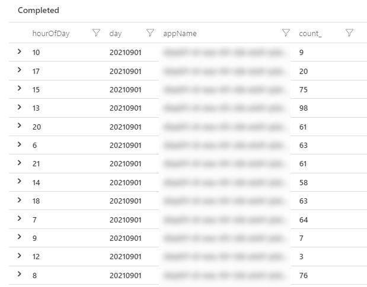

When running PaaS workloads in Azure, you often pay a certain fee for these services. In case of, for example, Azure App Services, these resources cannot be paused, which will net you some costs. When having larger, complexer sets of resources (for example, a Sitecore workload), costs might add up and when having multiple workloads, those costs will increase even harder. Lower environments, such as Dev, Test, Acceptance, Quality, or whatsoever, are often running 24/7, while they are not, or just a bit, utilized, however, it's not visible how much % of the time they are utilized and when this happens. In order to overcome this, I created a kusto query and a power bi report to acquire these insights. In a few blogposts I will give a small overview, show how to create the query, how to import the data into Power BI and how to create some neat heatmaps in the Power BI reports.

> _This is part 2 of 4 of this blogpost series_
>
> - part 1 - [Introduction: in this blogpost I will cover the outcomes on "getting insight on your platfrom utilization](..\getting-insights-in-your-paas-utilization-using-app-insights-and-power-bi-part-1)
> - part 2 _(this blogpost)_ - How to create the kusto query
> - part 3 - [How to create the Power BI report](..\getting-insights-in-your-paas-utilization-using-app-insights-and-power-bi-part-3)
> - part 4 - [How to create heatmaps in Power BI](..\getting-insights-in-your-paas-utilization-using-app-insights-and-power-bi-part-4)

In the previous blogpost I explained what kind of reports will be created. In order to create these reports, data is needed, this blogpost will explain how to get this data.

## Generate an activity overview for a single environment

In order to be able to generate an activity overview, it's not relevant to count the **amount** of requests, but if there lessis **any** activity on an environment.

> My definition of activity: When more than **10 http requests** are made to a web-server (in the case of Sitecore: a Content Delivery server) within an **hour**, than this complete environment can be marked as "in use" or "active". This includes human interaction or automated tests

Following the definition above, an environment has a score "0" for an hour with less thant 10 requests, while it gets score "1" when there are 10 requests or more. To have valid data, bot activity and availablity tests should be removed. In my case, only human interactions and automated webtests (which is, for us, a valid activity as well) are being reported.

The kusto-query below gives an overview over the last month for a certain environment, which is tied to application insights. By removing browser activity, app insights availability tests and bot activities, I made sure to end up with a clean dataset. We also only include entries with a certain cloud_rolename, as there were some other app services attached which we didn't want to include into the results (this is specific to Sitecore)

To this dataset, the hour of the day was added and all that was left, was to summarize the amount of http requests per hour, per day and per app. Please take note of the fact that I didn't include the "businessrule" to determine whether or not there was activity, as I planned to do that in the PowerBI report. The reason is that changing that business rule in PowerBI tends to be faster than rerunning the query over a large dataset. So the count\_ in this overview, displays the amount of http requests per hour, per day, per app. Using the logic of "10 requests or more" is an active environment, this would result in the rows with "hourOfDay" 10, 9, 12 being marked as "not active"

```csharp {numberLines: true}
let endOfPreviousMonth=endofmonth(startofmonth(now()) - 1h);
let startOfPreviousMonth=startofmonth(endOfPreviousMonth);
let dataset=requests
    | where timestamp > startOfPreviousMonth and timestamp < endOfPreviousMonth
    | where cloud_RoleName has_any ("CM", "CD", "S WEU")
    | where client_Type != "Browser"
    | where operation_SyntheticSource  !contains "Application Insights Availability"
    | where operation_SyntheticSource  !contains "Bot"

;
dataset
| extend hourOfDay = hourofday(timestamp)
| extend day = format_datetime(timestamp, 'yyyyMMdd')
| summarize count_=sum(itemCount) by hourOfDay, day, appName
| order by day asc
```

this query results in the following table:



## Querying multiple application insights instances

This specific query works with a single environment, but can work with multiple environments as well. The appName was included in the dataset, in order to be able to diverge between the different environments. In order two include data of multiple application insight instances, there area few methods to achieve that:

- select one or more scopes in the UI _- this might give a very slow user experience when working with loads of instances_
- explicitly add the app-dataset in the query using the union statement.

The latter has my preference, as it allows us to use this query within PowerBI at a later stage (see the next blogpost):

```csharp
let allSources = union withjsource=SourceApp,
app('app-name-1').requests,
app('app-name-2').requests,
app('app-name-3').requests;
```

the total query would be:

```csharp
let endOfPreviousMonth=endofmonth(startofmonth(now()) - 1h);
let startOfPreviousMonth=startofmonth(endOfPreviousMonth);

let allSources = union withjsource=SourceApp,
app('app-name-1').requests,
app('app-name-2').requests,
app('app-name-3').requests;

let dataset=allSources
    | where timestamp > startOfPreviousMonth and timestamp < endOfPreviousMonth
    | where cloud_RoleName has_any ("CM", "CD", "S WEU")
    | where client_Type != "Browser"
    | where operation_SyntheticSource  !contains "Application Insights Availability"
    | where operation_SyntheticSource  !contains "Bot"

;
dataset
| extend hourOfDay = hourofday(timestamp)
| extend day = format_datetime(timestamp, 'yyyyMMdd')
| summarize count_=sum(itemCount) by hourOfDay, day, appName
| order by day asc
```

## Summary

Getting the activity data out of application insights is not hard and can be executed with a simple query over multiple instances. Read next blogpost on how to get the data into Power BI the easy way.
