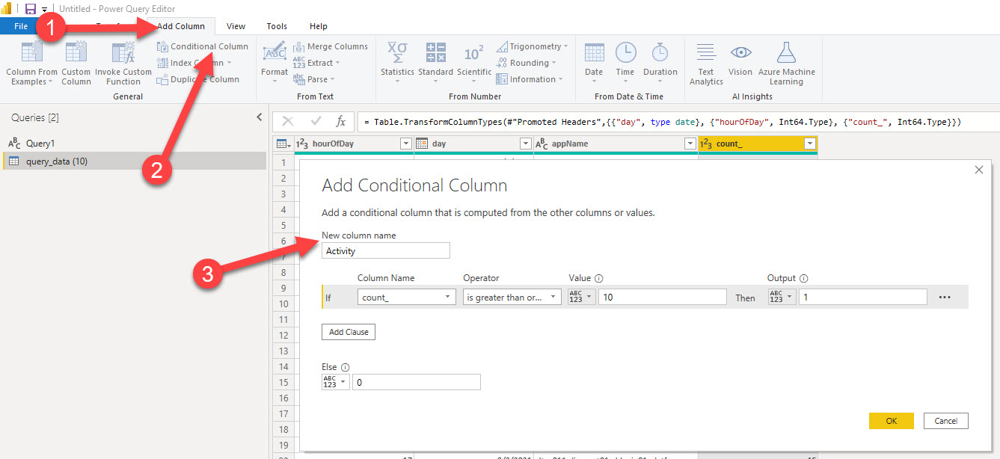

When running PaaS workloads in Azure, you often pay a certain fee for these services. In case of, for example, Azure App Services, these resources cannot be paused, which will net you some costs. When having larger, complexer sets of resources (for example, a Sitecore workload), costs might add up and when having multiple workloads, those costs will increase even harder. Lower environments, such as Dev, Test, Acceptance, Quality, or whatsoever, are often running 24/7, while they are not, or just a bit, utilized, however, it's not visible how much % of the time they are utilized and when this happens. In order to overcome this, I created a kusto query and a power bi report to acquire these insights. In a few blogposts I will give a small overview, show how to create the query, how to import the data into Power BI and how to create some neat heatmaps in the Power BI reports. 

> *This is part 3 of 4 of this blogpost series* 
> * part 1  - [Introduction: in this blogpost I will cover the outcomes on "getting insight on your platfrom utilization](..\getting-insights-in-your-paas-utilization-using-app-insights-and-power-bi-part-1)
> * part 2 - [How to create the kusto query](..\getting-insights-in-your-paas-utilization-using-app-insights-and-power-bi-part-2)
> * part 3 *(this blogpost)* - How to import your data from application insights into Power BI
> * part 4 - [How to create heatmaps in Power BI](..\getting-insights-in-your-paas-utilization-using-app-insights-and-power-bi-part-4)

This third and last blogpost will explain on how to get the data from application insights into power bi and how to generate the reports
## 1 - Export the application insights query
The first step is to export your query to Power BI. This can be done through the UI in log analytics

This will result in a file that can be downloaded, which  contains the complete M-query which should be imported in Power BI. 

## 2 - Import the query into Power BI
In order to do this, select "Blank Query" under "Get Data":

The next step is to open the advanced editor and paste the contents of the file in this editor. :

> Note: I did not specify any authentication method. Based on * situation* an alternative authentication method may be needed. I won't go into this approach in this article.

## 3- Alter the dataset for the report
This results into a dataset with a few columns. Change the type of each column to the right dataset:
ColumnName | type
--- | ---
hourOfDay | Whole Number
day | Date
appName | Text
count_ | Whole Number

After changing the data types, add a conditional column, this contains the business logic to determine activity:

The dataset is now ready to use

## Summary
In a few steps, we were able to retrieve data, using a custom kusto-query, from multiple application insights instances. The dataset was shaped in such a way, that it provides the data needed for the heatmaps that we want to create. More on that in the following blogpost.

