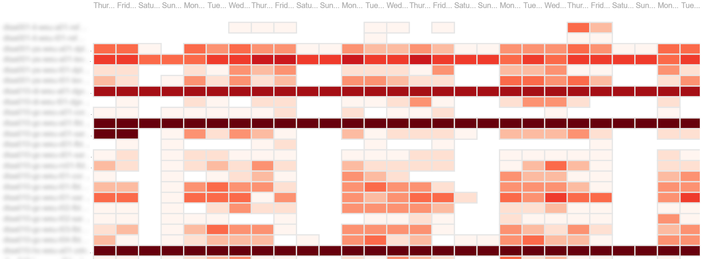
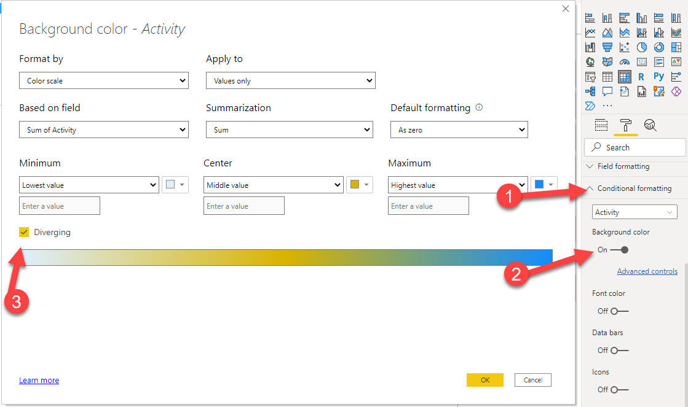
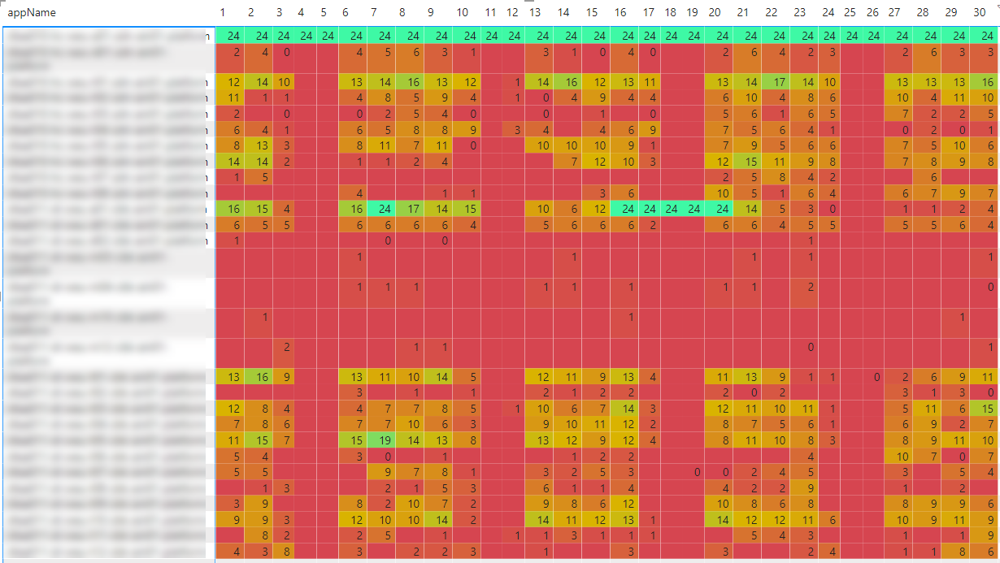
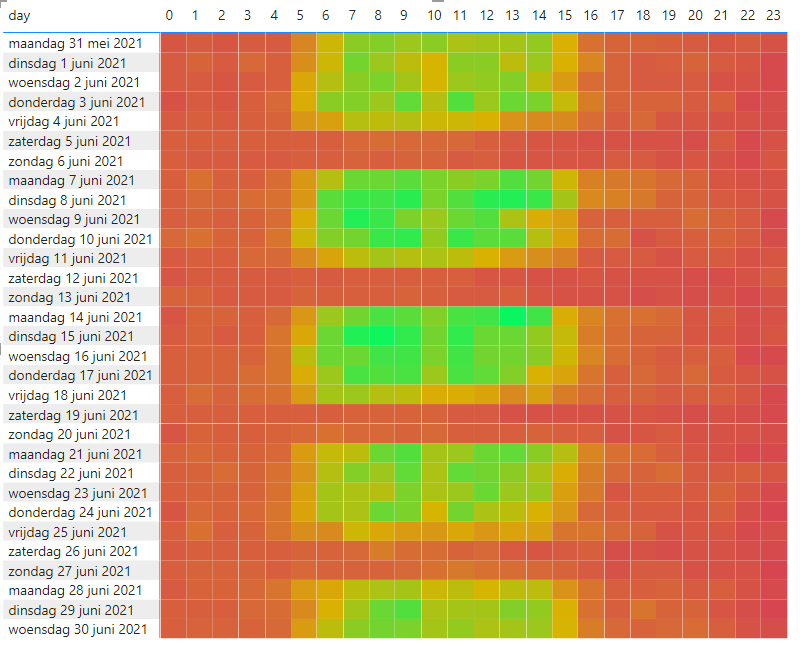

When running PaaS workloads in Azure, you often pay a certain fee for these services. In case of, for example, Azure App Services, these resources cannot be paused, which will net you some costs. When having larger, complexer sets of resources (for example, a Sitecore workload), costs might add up and when having multiple workloads, those costs will increase even harder. Lower environments, such as Dev, Test, Acceptance, Quality, or whatsoever, are often running 24/7, while they are not, or just a bit, utilized, however, it's not visible how much % of the time they are utilized and when this happens. In order to overcome this, I created a kusto query and a power bi report to acquire these insights. In a few blogposts I will give a small overview, show how to create the query, how to import the data into Power BI and how to create some neat heatmaps in the Power BI reports.

> _This is part 4 of 4 of this blogpost series_
>
> - part 1 - [Introduction: in this blogpost I will cover the outcomes on "getting insight on your platfrom utilization](..\getting-insights-in-your-paas-utilization-using-app-insights-and-power-bi-part-1)
> - part 2 - [How to create the kusto query](..\getting-insights-in-your-paas-utilization-using-app-insights-and-power-bi-part-2)
> - part 3 - [How to import your data from application insights into Power BI](..\getting-insights-in-your-paas-utilization-using-app-insights-and-power-bi-part-3)
> - part 4 _(this blogpost)_- How to create heatmaps in Power BI

## Heatmaps

When talking about platform utilization, heatmaps are useful to show patterns, such as are all platforms evenly utilized, how are they utilized and how many platforms show activity at a given time of a day. Keys is the relationship between two variables: platfrom x day, activity on a date \* hourly base, et cetera.

### Heatmaps in Power BI - various ways to build heatmaps

It turned out that I found two components very valuable to build heatmaps:

1. [Microsoft Table Heatmap](https://appsource.microsoft.com/en-us/product/power-bi-visuals/WA104380818?tab=Overview) - a custom visual made by Microsoft
2. The Out of the box Matrix visualization

### Microsoft Table Heatmap

Although it just got a 2 star rating, it turned out to be very valuable when I started my journey. I had great results in no time and it has some great visualization options.

When in need of automatically updating data, this visual is not useable for _this_ situation: every row has to be added manually to the visualization. As the rows change over time, as applications come and go, this a very time consuming and doesn't fit into the automatic generation of reports. In addition of this: as we have a very straigthforward table (as can be seen in [this blogpost](..\geosearch-with-fast-search-for-sharepoint-2010-part-2-custom-pipeline-extensions)), the dataset needs to be pivoted as well. With every dataset refresh, this may lead to a new structure of the pivoted table being created.

### Matrix

Fiddling around with the different visualizations, I stumbled upon the "Matrix" visual - a very basic, but powerful visualization. At first sight, it is "just a bunch of numbers", but the there is a real beauty behind it. As learned in the previous blogposts, two heatmaps were needed:

- A heatmap with the amount of hours of activity per day, per environment
- A heatmap with the total amount of active environments per hour per day

#### amount of hours of activity per day, per environment

The configuration is very straightforward:

- select a datafield for the rows (appName)
- select a datafield for the columns (Date)
- select a datafield with the value attached to it (activity)

Whenever the values in the columns and/or rows change, this leads to an automatic update of the columns and/or rows - hence, it doesn't need any manual interaction anymore, as opposed to the Microsoft Table heatmap.

The real power shines in it's conditional formatting:

This leads to a visualization which might look like the visual below:

Within a glimp of an eye, it becomes clear what environments are active, fairly active and "not so active"

#### total amount of active environments per hour per day

When creating a new matrix with the following columns, the heatmap "total amount of active environments per hour per day" will be created

- select a datafield for the rows (Date)
- select a datafield for the columns (hourOfDay)
- select a datafield with the value attached to it (activity)

In the visual below, I hide the actual numbers, but it gives an overview of the occupation per day
.

These numbers can be used for the calculation of the amount of hours that should be assigned to the [reservation discounts](https://docs.microsoft.com/en-us/azure/cost-management-billing/reservations/reservation-discount-app-service) for the various services. But that is input for another blogpost

#### Summary

Whenever a dataset is available, creating a heatmap becomes very, very easy. We have learned how to setup the Matrix, apply conditional formatting, in order to generate an automatically updated heatmap, fed by various application insight instances
