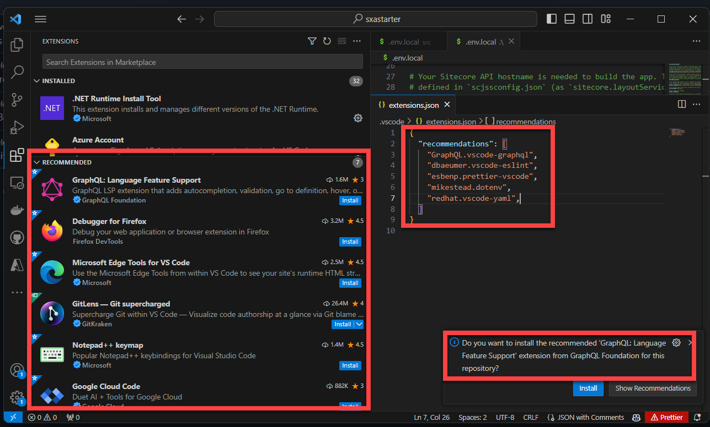
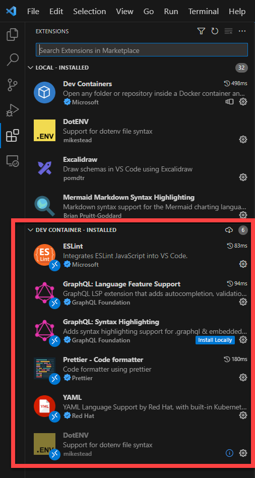
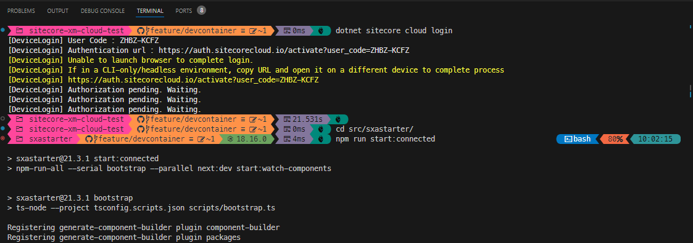

In my previous two blogposts I described the benefits of working with WSL2 and how to configure this environment in order to work with it. This blogpost is all about developing for xmCloud within a DevContainer. I first ran into devcontainers when developing a [custom sitecore segment](../oh-my-sitecore-I-powered-up-your-shell/) for [Oh-my-posh](https://ohmyposh.dev/). As it is written in GO, I would have to install the complete development environment on my local machine, or in a VM. I luckily quickly found out about the devcontainer: It provided a complete environment with all the tooling I needed, with all recommended vscode plugins pre-installed as well. This is a real game-changer in terms of the onboarding process. All you need is Docker and VSCode. This blogposts briefly describes how a devcontainer can be setup and I'll share the steps that I took to get the startkerit up and running for XMCloud inside a devcontainer.

## benefits

As shared in the introduction, devcontainers (may) deliver a completely pre-configured environment. This benefit is not neglectable, as:

* your onboarding-speed for new developers will increase towards the speed of light
* you can make sure to work with the same (development) tools accross your team(s)
* you can makre sure to work with the same versions of your software (think about node and breaking changes?)
* It can be run in Github codespaces! (yay)

One of the downsides, is that some commands run a bit slower (I'll update my post [Develop in WSL - the benefits](../getting-started-develop-for-xm-cloud-in-wsl2-benefits/) blogpost soon with these numbers), but it is still faster as opposed to native windows 11 development.

## Create a devcontainer file for XM Cloud

Creating a devcontainer file and using it, require a few steps:

1. Create the configuration file ```.devcontainer/devcontainer.json```
2. Create a configuration script in order to install extra tooling
3. Reopen your repository in the container

### the devcontainer.json

The devcontainer describes your environment. In the code-snippet below, I configured the following:

* The baseimage to use
* VSCode extensions
* port to forward from the container to the host
* an extra script to run at creation, to install extra tooling 

```yaml    
{
    "image": "mcr.microsoft.com/devcontainers/typescript-node:0-18",
    "customizations": {
        "vscode": {
        "extensions": [            
            "GraphQL.vscode-graphql",
            "dbaeumer.vscode-eslint",
            "esbenp.prettier-vscode",
            "mikestead.dotenv",
            "redhat.vscode-yaml"
            ]
        },
    },
    "forwardPorts": [3000],
    "postCreateCommand": "bash scripts/install.sh"
}
```

#### The image

As the xmcloud frontend runs on nextjs, a typescript / nodejs devcontainer image was chosen. This can be seen on line 2 of the ```devcontainer.json```. Microsoft has a list of their devcontainer images [here](https://github.com/devcontainers/images/tree/main/src)

```yaml{2}    
{
    "image": "mcr.microsoft.com/devcontainers/typescript-node:0-18",
    "customizations": {
        "vscode": {
        "extensions": [            
            "GraphQL.vscode-graphql",
            "dbaeumer.vscode-eslint",
            "esbenp.prettier-vscode",
            "mikestead.dotenv",
            "redhat.vscode-yaml"
            ]
        },
    },
    "forwardPorts": [3000],
    "postCreateCommand": "bash scripts/install.sh"
}
```


#### VSCode extensions and recommendations

The customization section can contain [product specific configuration](https://containers.dev/supporting). The [specific customizations for vscode](https://containers.dev/supporting#visual-studio-code) gives the possibility to specify extensions that need to be installed and default settings. 

##### VSCode extensions

When an extensions.json is available in the .vscode folder, it may contain one or more recommendatins that vscode should show in your extensions toolbar:



##### install VSCode extensions by default

I chose the recommended extensions that the starterkit comes with. I introduced these recommendations at the start of this year to [Sitecore.Demo.Edge](https://github.com/Sitecore/Sitecore.Demo.Edge/pull/500) and it since has been adopted by Sitecore to include in all of their codebases. 

For devcontainers, these customizations can be specified in the ```customizations``` section. This can be seen at lines 4-10 of the ```devcontainer.json```

```yaml{4-10}    
{
    "image": "mcr.microsoft.com/devcontainers/typescript-node:0-18",
    "customizations": {
        "vscode": {
        "extensions": [            
            "GraphQL.vscode-graphql",
            "dbaeumer.vscode-eslint",
            "esbenp.prettier-vscode",
            "mikestead.dotenv",
            "redhat.vscode-yaml"
            ]
        },
    },
    "forwardPorts": [3000],
    "postCreateCommand": "bash scripts/install.sh"
}
```

This results in the extensions being installed within  the container:



#### Forward ports

The port which needs to be exposed to the outer world, in order to be able to connect to. Port 3000 was chosen, as this is the port that the starterkit uses as well

#### postCreateCommand

With this command, extra actions can be executed, to install extra tooling. This could be done by [configuring devcontainer features](https://code.visualstudio.com/blogs/2022/09/15/dev-container-features) as well, but this approach was faster (in terms of trying things out) and more approachable for me. 

```yaml{14}    
{
    "image": "mcr.microsoft.com/devcontainers/typescript-node:0-18",
    "customizations": {
        "vscode": {
        "extensions": [            
            "GraphQL.vscode-graphql",
            "dbaeumer.vscode-eslint",
            "esbenp.prettier-vscode",
            "mikestead.dotenv",
            "redhat.vscode-yaml"
            ]
        },
    },
    "forwardPorts": [3000],
    "postCreateCommand": "bash scripts/install.sh"
}
```

In this specific solution a bash-script runs in order to execute some extra commands. The same steps that were used to [configure WSL2](../getting-started-develop-for-xm-cloud-in-wsl2/) were used, but executed differently.

* Install Micorosoft .Net 6 SDK
* Install Sitecore CLI
* Install oh-my-posh

```bash
## install .Net 6 SDK
wget https://packages.microsoft.com/config/debian/11/packages-microsoft-prod.deb -O packages-microsoft-prod.deb
sudo dpkg -i packages-microsoft-prod.deb
rm packages-microsoft-prod.deb
sudo apt-get update
sudo apt-get install -y dotnet-sdk-6.0

## restore sitecore tooling
dotnet tool restore

## install oh my posh
curl -s https://ohmyposh.dev/install.sh | sudo bash -s
oh-my-posh font install 3270
cp scripts/jandobbeleer.omp.json ~/

# set omp config
echo 'eval "$(oh-my-posh init bash --config /home/node/jandobbeleer.omp.json)"' >>~/.bashrc

# restore npm to have a completely prepared environment
npm install --prefix ./src/sxastarter
```
### reopen in container

The last thing to leaves us apart from running this development environment in a container, is opening it in a container. The first time this happens, the container has te be build.

First, press ```CTRL + SHIFT + P``` and select the action ```>Dev Containers: Rebuild without cache and Reopen in Container```. This command causes the container to be build for the first time and install the extra tooling on top of it. A log, similar to the log shows up in your terminal window. 


```bash
[3578 ms] Start: Run: tar --no-same-owner -x -f -
[3586 ms] Start: Run: docker build -f /tmp/devcontainercli-bas/updateUID.Dockerfile-0.51.3 -t vsc-sitecore-xm-cloud-test-19965dd6a6e64714ce55d7f718e675c80e7ab3c6eeb910d2442ae888ced745e1-uid --build-arg BASE_IMAGE=mcr.microsoft.com/devcontainers/typescript-node:0-18 --build-arg REMOTE_USER=node --build-arg NEW_UID=1000 --build-arg NEW_GID=1001 --build-arg IMAGE_USER=root /tmp/devcontainercli-bas/empty-folder
[+] Building 50.3s (3/5)                                         docker:default
 => [1/2] FROM mcr.microsoft.com/devcontainers/typescript-node:0-18@sha2  49.9s
 => => sha256:965c60d33390c6fe279d8c20c9e130ae4d87a8f839 7.54MB / 7.54MB  26.1s
 => => sha256:d4e304a2f6842ba2d2a3c0a96db84728bac63dad 45.02MB / 45.02MB  35.2s
 => => sha256:c3697c427c099f3993f1ee11acf72dedce451f2176aade 425B / 425B  30.5s
 => => sha256:8bf8474de19db40be76f2eda2b99d8539fa9778d318399 226B / 226B  30.8s

....


[4497 ms] Start: Run in container: /bin/sh -c bash scripts/install.sh
--2023-10-09 09:55:51--  https://packages.microsoft.com/config/debian/11/packages-microsoft-prod.deb
Resolving packages.microsoft.com (packages.microsoft.com)... 13.80.99.124
Connecting to packages.microsoft.com (packages.microsoft.com)|13.80.99.124|:443... connected.
HTTP request sent, awaiting response... 200 OK
Length: 3134 (3.1K) [application/octet-stream]
Saving to: 'packages-microsoft-prod.deb'

packages-microsoft- 100%[===================>]   3.06K  --.-KB/s    in 0s      

2023-10-09 09:55:51 (44.3 MB/s) - 'packages-microsoft-prod.deb' saved [3134/3134]

....

Run `npm audit` for details.
npm notice 
npm notice New major version of npm available! 9.5.1 -> 10.2.0
npm notice Changelog: https://github.com/npm/cli/releases/tag/v10.2.0
npm notice Run npm install -g npm@10.2.0 to update!
npm notice 
Done. Press any key to close the terminal.
```

### Start doing awesome things

Now that the repository and development environment has been reopened in a devcontainer, the regular development flow can be started. Let's connect to Sitecore cloud and run the webapplication, connected to Experience edge. Please note that, because NPM install has already been executed during the creation of the container, the application can be started right away:



## summary

Creating a development container doesn't take much effort, and gives you the possibility to create a standardized development environment, which can be run anywhere! 