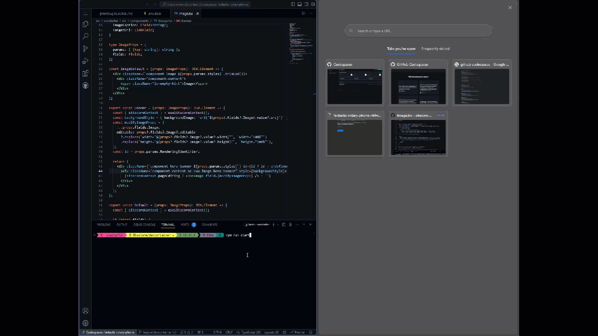
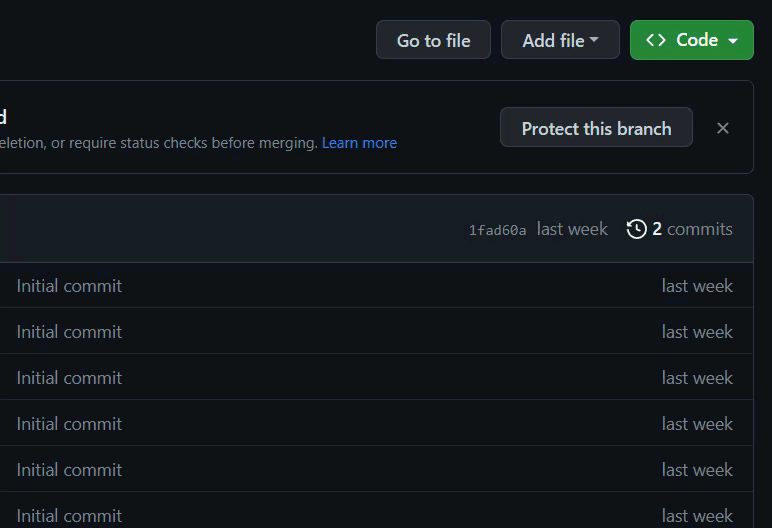

Ok, I am impressed. As I was experimenting with [devcontainers](../getting-started-develop-for-xm-cloud-in-a-dev-container/), my respected collague [Stefan Roks](theroks.com) pointed me out that I should be able to run this container in github codespaces as well. And while I was in a hurry, I really, really wanted to test this out and guess what? I got it up and running in *under* 5 minutes



### Awesomeness

The gif above displays a vscode editor on the web, within a github codespace. The is also running within this codespace and has a public url. So how does this work?

1. Read my [previous blog and create a devcontainer.json](../getting-started-develop-for-xm-cloud-in-a-dev-container/)
2. Create a codespace
3. make a small change to your environment variables
4. npm run start:connected

## Setup codespaces

Assuming that a devcontainer already has been created, the first step required is to create a codespace.

* Navigate to your repository
* Under the "Code" button, switch from local to codespaces and create a codespace for the according branch

    

Make a small change to the ```./src/sxastarter/.env```. As nextJS needs to know what the "PUBLIC_URL" is, this needs to be configured. Luckily, this one can be concatenated from a few available environment variables that google provides within codespaces. A list of default environment variables can be found [here](https://docs.github.com/en/codespaces/developing-in-codespaces/default-environment-variables-for-your-codespace). Port 3000 is momentarily hardcoded in the nextjs starterkit, so i didn't make any effort in making that one configurable as well ;)

```bash
PUBLIC_URL=https://${CODESPACE_NAME}-3000.${GITHUB_CODESPACES_PORT_FORWARDING_DOMAIN}/
```

Last, but not least, it is time to get the website up and running:

```bash
npm run start:connected
```

This is al you need to do in order to get the magic started :D