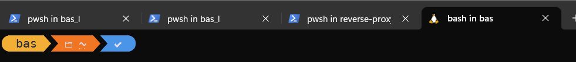
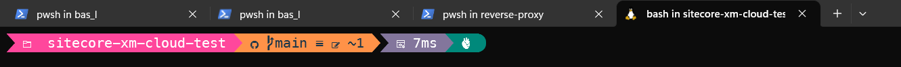
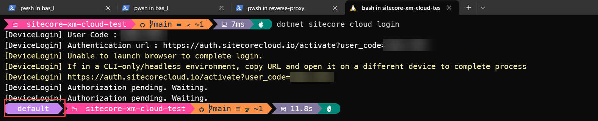
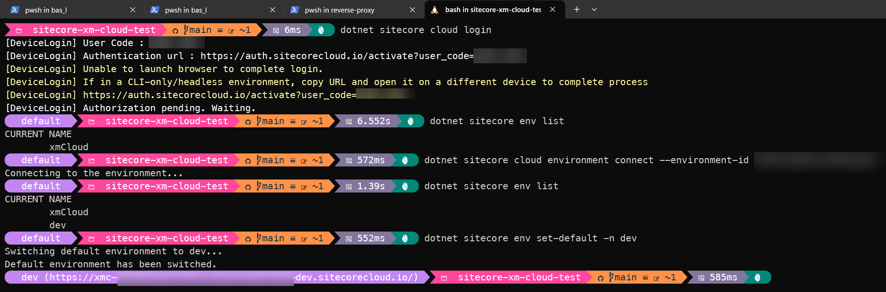

In the Sitecore universe, Sitecore XM cloud is the next best thing. Not having to develop for Sitecore on your local machine, but in the cloud, is a huge step forward. [Sebastian Winter](https://www.linkedin.com/in/sebastian-winter-506962165/?originalSubdomain=de), Developer Advocete for Sitecore, did an excellent job with [this video](https://www.youtube.com/watch?v=Kig3kWZ8FuQ) to get you up and running on Windows. However, frontend developers tend to prefer to work on MacOS, Linux, or WSL2, in order to get some (major) speed improvements. For WSL2, it does require some setup. In this blogpost, I'll explain how to setup your machine to develop for Sitecore XM Cloud in WSL2. I'll describe how a fresh Ubuntu 22 instance can be setup to get you ready.

## Steps to take

1. (Optional) Install a fresh ubuntu 22 WSL instance.
2. (Optional) Install Oh-my-posh for an awesome prompt - WITH Sitecore CLI integration! 
3. Configure the git Credential Manager
4. Install the Sitecore CLI (and see your prompt shine)
5. Install Frontend tooling in order to build your xmcloud installation

### (Optional) Install a fresh ubuntu 22 WSL instance

If you don't have a WSL2 instance yet, you can install one by following the steps on [this page](https://docs.microsoft.com/en-us/windows/wsl/install-win10). I prefer to use Ubuntu 22, but you can choose any distro you like. For my setup, I chose to install a second instance, following [this blogpost](https://cloudbytes.dev/snippets/how-to-install-multiple-instances-of-ubuntu-in-wsl2).

### (Optional) Install Oh-my-posh for an awesome prompt - WITH Sitecore CLI integration

I [recently wrote a plugin](https://blog.baslijten.com/oh-my-sitecore-I-powered-up-your-shell/) for [oh-my-posh](https://ohmyposh.dev/) for the [Sitecore CLI integration](https://ohmyposh.dev/docs/segments/sitecore). 

Follow the installation instructions for Linux and windows terminal [over here](https://ohmyposh.dev/docs/installation/linux).

Below are the steps that I followed:

1. Install unzip ```sudo apt install unzip``` 
2. Install: ```curl -s https://ohmyposh.dev/install.sh | sudo bash -s```
3. Install the Meslo nerd font: ```oh-my-posh font install``` and select ```Meslo``` from the list
  > To ensure correct rendering of the glyphs you will need to enable the option Use the new text renderer ("AtlasEngine") in your terminal settings. For further details, see here. Also, make sure to setup the font that is being used in terminal 
  ```json
  {
    "profiles":
    {
        "defaults":
        {
            "fontFace": "MesloLGM Nerd Font"
        }
    }
  }
  ``` 

4. Download a custom theme. I really like the this one. Make sure to download it to your root directory: ```curl https://raw.githubusercontent.com/JanDeDobbeleer/oh-my-posh/main/themes/jandedobbeleer.omp.json --output custom.json```
5. Add this specific Sitecore Segment to the custom theme:
   ```
   {
          "background": "#c386f1",
          "foreground": "#ffffff",
          "leading_diamond": "\ue0b6",
          "style": "diamond",
          "template": "  {{ .EndpointName }} {{ if .CmHost }}({{ .CmHost }}){{ end }} ",
          "trailing_diamond": "\ue0b0",
          "type": "sitecore"
        },
   ```
6. Change the prompt. Add ```eval "$(oh-my-posh init bash --config ~/custom.json)"``` to the end of your ~\.profile file
7. close your session and open it again. Your prompt should look something like this now:


   
### Configure git and clone the xm-starter-kit

When cloning a repo, on a fresh Ubuntu machine, you will be prompted for a password:

```bash
bas@Monstar:~/git$ git clone https://github.com/BasLijten/sitecore-xm-cloud-test
Cloning into 'sitecore-xm-cloud-test'...
Username for 'https://github.com':
```

Git is prompting for a plain password, and this is deprecated functionality. I prefer to use the git credential manager for this, which can be referenced from windows:

```bash
git config --global credential.helper "/mnt/c/Program\ Files/Git/mingw64/bin/git-credential-manager-core.exe"
```

Now, when cloning a repo, you won't be prompted for a username or password and the repo will be cloned.

```bash
bas@Monstar:~/git$ git config --global credential.helper "/mnt/c/Program\ Files/Git/mingw64/bin/git-credential-manager-core.exe"
bas@Monstar:~/git$ git clone https://github.com/BasLijten/sitecore-xm-cloud-test
Cloning into 'sitecore-xm-cloud-test'...
warning: git-credential-manager-core was renamed to git-credential-manager
warning: see https://aka.ms/gcm/rename for more information
warning: git-credential-manager-core was renamed to git-credential-manager
warning: see https://aka.ms/gcm/rename for more information
remote: Enumerating objects: 309, done.
remote: Counting objects: 100% (309/309), done.
remote: Compressing objects: 100% (267/267), done.
remote: Total 309 (delta 9), reused 238 (delta 4), pack-reused 0
Receiving objects: 100% (309/309), 286.02 KiB | 2.62 MiB/s, done.
Resolving deltas: 100% (9/9), done.
bas@Monstar:~/git$ ls -alF
total 12
drwxr-xr-x 3 bas bas 4096 Oct  2 09:48 ./
drwxr-x--- 3 bas bas 4096 Oct  2 09:48 ../
drwxr-xr-x 8 bas bas 4096 Oct  2 09:48 sitecore-xm-cloud-test/
bas@Monstar:~/git$
```

if making use of oh my posh, you'll see a nice git segment in the prompt, sharing information about the current state:



### Install the Sitecore CLI (and see your prompt shine)

First, dotnet needs to be installed, as Ubuntu doesn't ship with it. The sitecore cli required dotnet-6. I used [this documentation](https://learn.microsoft.com/en-us/dotnet/core/install/linux-ubuntu-2204) to install it:

```bash
sudo apt-get update && \
  sudo apt-get install -y dotnet-sdk-6.0
```

After this update, the sitecore cli can be restored:

```bash
dotnet tool restore
```

followed by a login on your sitecore cloud environment:

```bash
dotnet sitecore cloud login
```

The CLI will prompt to login via a browser. Just CTRL+click this link, and you'll be able to login your CLI. Please take note of the prompt - an extra segment has been added which gives contextual information on which environment you are currently using:



next, connect to a new environment (I'll use a dev environment in xmcloud in this example), and verify that the environment has been added.

```bash
dotnet sitecore cloud environment connect --environment-id xxx
dotnet sitecore env list
```

Using the following command, your active environment, can be set. As I added ```dev```, I'll change my default environment to ```dev```. Using the env list command, you can verify that the default environment has been changed to ```dev```

```bash
dotnet sitecore env set-default -n dev
dotnet sitecore env list
```

Even better: this reflects in your prompt as well!


### Install Frontend tooling in order to build your xmcloud bits

In orde to use the tooling that has been written (and optimized!) for linux, make sure to not include the windows-path in your PATH variable. This can be done by adding the following lines to your /etc/wsl.conf:

```
[interop]
appendWindowsPath=false
```

After this, you have to close your WSL-session, and run ```Restart-Service LxssManager``` under administrator credentials. Afterwards, open a new WSL2 prompt. When running ```which npm``` and it doesn't give any results, you're good to go. Now, you can install the frontend tooling. Let's start with nvm:

```bash
curl -o- https://raw.githubusercontent.com/nvm-sh/nvm/master/install.sh | bash
```

After this, you can install the latest version of node:

```bash
nvm install --lts
```

Switch to your rendering host and run npm install:

```bash
cd src/sxastarter
npm install
```

Last, but not least, we'll need to make sure that vscode can be started from WSL2. Because we prevented the WindowsPath to be added to the PATH variable, we'll need to add the vscode path manually. make sure to replace {USERNAME} with your username:

```bash
export PATH=$PATH:"/mnt/c/Users/{USERNAME}/AppData/Local/Programs/Microsoft VS Code/bin"
```

Test if code can be started, and if this is the case, make this change permanent:

```bash
echo 'export PATH=$PATH:"/mnt/c/Users/{USERNAME}/AppData/Local/Programs/Microsoft VS Code/bin"' >> ~/.bashrc
```

## Summary

