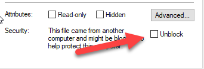

Sitecore released a nice Installation framework to install Sitecore, xConnect and configure Solr. I used this framework already a few times (on a few machines and it turned out that I am very proficient in breaking things. Especially Sitecore 9). During this installation I faced some inconvenient issues (and found out some tips) which I wanted to share with you. This should help you getting up and running even faster!

# Download the prerequisites and setup your resource directory

First, download the following files:

- [The installation guide](https://dev.sitecore.net/~/media/CBD83D3FE7CA470297CAA7807D1DB296.ashx)
- [The installation packages](https://dev.sitecore.net/~/media/CB45E46E57C34573B07F106D6991720A.ashx)
- [Solr 6.6.1](http://archive.apache.org/dist/lucene/solr/6.6.1/solr-6.6.1.zip)

Create a directory c:\\resourcefiles and extract the contents of the installation package to this folder. There should be a Sitecore scwdp.zip and an xConnect.scwdp.zip. Extract the content of “XP0 Configuration files rev.xxxxxx.zip” to the root of this directory as well. Last but not least: copy your license.xml. Make sure to unblock your xml and zip-files. Right click on each file and select “Properties”. Enable unblock and press OK.

# Install the latest version of the Sitecore Installation Framework

Use the following commands to install the latest version of SIF:

When this doesn't work, there might be a chance that you manually installed an older version. Remove it. It might be found it the <userdirectory>\\WindowsPowerShell\\Modules or in "C:\\Program Files\\WindowsPowerShell\\Modules"

# Install Solr, run as a windows service and setup https

The first prerequisite is to have Solr running over https. First, install Solr as you normally would, after the installation, you should visit [this blog](https://kamsar.net/index.php/2017/10/Quickly-add-SSL-to-Solr/) by Kam Figy as he wrote a nice script to setup https.

The Sitecore installation framework requires Solr to run as a windows service. When heading back from the Sitecore Symposium I tried to set this up, but didn’t get it to work. The trick: make sure to run solr as a foreground process: **solr.cmd -f -p 8983**. [This blog](https://www.norconex.com/how-to-run-solr5-as-a-service-on-windows/) helped me on how to set it up. They made use of a tool called [NSSM](https://nssm.cc/download)

# Enabled Contained database authentication

This is generally not a best practice, but xConnect requires the ability to login using a sql login. When you copy the query from the installation guide, all the commands are placed on a single line, which causes sql to bug out. Copy the sql query from the source below and you’re good to go!

# Download the configuration files

Don’t. As the Sitecore Installation framework uses a set of configuration files to deploy an environment, Sitecore provided a set of configuration files. The Installation guide tells us to download them from [https://dev.sitecore.net](https://dev.sitecore.net), but I spend like 20 minutes searching for them: they weren’t there. Turns out that they are part of the installation package.

# Install Sitecore and xConnect (and repeat when this fails)

The next step would be to install Sitecore. Sitecore provides a nice installation script, but again: it gives some problems while copy-and-pasting it. This gist provides the same script, but is more easier to copy. Save it as c:\\resourcefiles\\install.ps1 When the Solr-task gets executed and gives a strange error, this might be due to the fact [that the windows service hasn’t been started yet](http://blog.baslijten.com/solr-error-creating-solrcore-when-using-the-sitecore-installation-framework/).

It might be possible that the installation doesn’t end successfully (due to some configuration errors). Just re-starting the installation will not work, as the framework tries to reinstall the databases. As manually deleting them isn’t fun, I always stop the two web applications (xp0.sc and xp0.xconnect) and run the sql script below:

_it might be possible that the Marketing automation table cannot be deleted. I always delete this one manually, just make sure to tick the box “close existing connections”_

# Note to self: do not forget to run the post-installation steps

For some reason I always forget those. As xConnect will NOT work without those post-installation steps the script below really should be executed. As it came from the guide: when copy-pasting it from the guide, the query will bug out. Fire up your Sql management studio, create a new query and set the mode to SQLCMD.

# Conclusion

Having an automated installation is great and I will definitely use this over SIM, as this guide takes care of a secure installation, setups solr _and_ xConnect. However, there are some inconvenient issues which I just wrote down, I really hope it helps you to get up and running as soon as possible!
