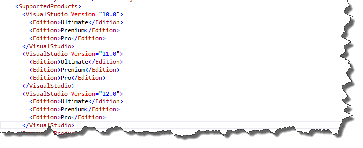

If you want to use the recently released Visual Studio 2015 preview together with Sitecore rocks for sitecore development, you won't be able to install this plugin from the Visual Studio Extensions gallery: you won't even find installable plugin while searching for the plugin. This blogpost describes how to get this plugin to work.

In fact, it's the same trick as was used for the Visual Studio 2013 preview as described in [this blogpost](http://www.sitecore.net/Learn/Blogs/Technical-Blogs/Getting-to-Know-Sitecore/Posts/2013/10/Sitecore-Rocks-and-Visual-Studio-2013.aspx 'how to use sitecore rocks with visual studio 2013 preview') on the sitecore site, although there is a small caveat.

First, [Download](https://visualstudiogallery.msdn.microsoft.com/44a26c88-83a7-46f6-903c-5c59bcd3d35b/ 'Sitecore rocks visual studio extension') the sitecore rocks visual studio extension from the gallery. Open this package with an archiving tool, in my case, I used 7-zip. Find the file named "extension.vsixmanifest". This file describes on what Visual studio versions the extension can be installed. Open the file inside the archive and find the following section:

It would be to easy to add the same xml snippet for Visual Studio Version 13.0: There is no spoon ;). As the number "13" is an unlucky number, Microsoft tends to skip all these versions, like they did for the Office and SharePoint products as well.

Just add the xml snippet below, save your manifest and install the extension manually: you will now see that the extension gets installed

\[xml\] <VisualStudio Version="14.0"> <Edition>Ultimate</Edition> <Edition>Premium</Edition> <Edition>Pro</Edition> </VisualStudio> \[/xml\]

et voila: your extension can be installed!

