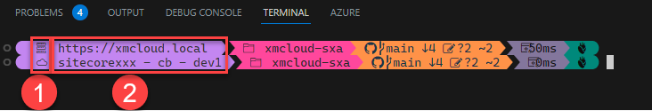

I love to make my work a bit more pleasant by having the right information at the right time. My work is also more pleasant when I work in an aesthetically designed environment. [Oh-my-posh](https://ohmyposh.dev) solves both for me, as it is a prompt theme engine which works with any shell. It allows to include any kind of data in a custom designed prompt, by the use of custom "segments". Think about battery information, realtime blood sugar information for diabetics, current node version, git info, you name it. However, it ~~is~~ was lacking one thing: Information of the Sitecore CLI: to which environment are you connected? You might be connected to the wrong environment, which may cause all kinds of error, for example, pushing the right data to the wrong environment ;). Being inspired by a [live coding session](https://youtu.be/_meKUIm9NwA) between [Scott Hanselman](https://www.hanselman.com/blog/) and [Jan de Dobbeleer](https://github.com/JanDeDobbeleer/), in which they made [a new custom segment for realtime Blood sugar readings](https://www.hanselman.com/blog/a-nightscout-segment-for-ohmyposh-shows-my-realtime-blood-sugar-readings-in-my-git-prompt), I decided to hop on and made my first contribution to an awesome open source project. Why?

- [x] Contributing to one of the most awesome prompt theme engines?
- [X] Making the first steps in a new language? (GoLang)
- [X] Powering up your Sitecore CLI by never pushing data to the wrong environment anymore and sharing this with the Sitecore community
- [X] Just because I could

## What does it do exactly?

In the end, it shows the current default environment which is configured in your Sitecore ```\.sitecore\user.json``` directory. The information is taken from that configuration file and can be show as part of the custom prompt:



With the basic template, it will show two pieces of information:

1. The kind of environment - is it a Sitecore XM cloud environment, or any other kind of environment?
2. The environment name - based on the hostname configured in your sitecore configuration file.

> Please note that any icon can be used and the environment can be displayed in any way: more on that later

## How does this segment work?

All information is retrieved from the ```\.sitecore\user.json``` file in your current project. From your current path, the first parent directory that contains that ```\.sitecore\user.json``` file is used as context. Let's assume that this file has the following contents:

```json{5-10}
{
  "endpoints": {
    "xmcloud": {
      "allowWrite": false,
      "host": "https://xmclouddeploy-api.sitecorecloud.io/",
      "authority": "https://auth.sitecorecloud.io/",
      "accessToken": "eyJhbGciOiJSUz...<redacted>",
      "refreshToken": "v1....<redacted>",
      "clientId": "...<redacted>...",
      "variables": {
        "xmCloudMonitoringHost": "https://xmcloud-monitoring-api.sitecorecloud.io/"
      },
      "audience": "https://api.sitecorecloud.io"
    },
    "default": {
      "ref": "xmcloud",
      "allowWrite": true,
      // imaginary url's
      "host": "https://xmcloud.local",
      "variables": {}
    },
    "local": {
      "ref": "xmCloud",
      "allowWrite": true,
      "host": "https://cm-sitecorexxx-cb-dev1.sitecorecloud.io",
      "variables": {}
    },
    "dev2": {
      "ref": "xmCloud",
      "allowWrite": true,
      "host": "https://cm-sitecorexxx-cb-dev2.sitecorecloud.io",
      "variables": {}
    },
    "dev3": {
      "ref": "xmCloud",
      "allowWrite": true,
      "host": "https://cm-sitecorexxx-cb-dev3.sitecorecloud.io",
      "variables": {}
    }
  },
  "$schema": "./schemas/UserConfiguration.schema.json"
}
```

Based on the environment name, a choice is made whether or not the environment is connected to XM cloud, or any other environment - the choice can be made based on the contents of the hostname. if it ends with "sitecorecloud.io", the environment is a SaaS environment, otherwise, it isn't.

That kind of information is provided by the segment to the theming engine: ```Cloud``` and ```Environment```. Using go's [text/template](https://pkg.go.dev/text/template) feature, extended with all [sprig](https://masterminds.github.io/sprig/) functionality, some awesome pieces of information can be created.

The default template that is provided, is as follows:

```go
{{ if .Cloud }}\uf65e{{ else }}\uf98a{{ end }} {{ if .Cloud }}{{ $splittedHostName := split \".\" .Environment }}{{ $myList := split \"-\" $splittedHostName._0 }} {{ $myList._1 }} - {{ $myList._2 }} - {{ $myList._3 }}{{ else }} {{ .Environment }} {{ end }}
```

as seen above, the template functionality, in combination with the sprig extension, offers some powerfull templating options. An If-then-else construction to display a different icon based the cloud boolean and another way of displaying information about the environment, based on that boolean. As the sprig extension offers the possibility to split a string and display different parts of information of it, the segment can be fully customized without having to modify the oh-my-posh code.

## Next plans

While writing this blogpost, I got some other ideas for this segment; in the future, I would like to make it a bit more configurable, in order to being able to display different items for kubernetes, azure, on-premise and SaaS. 

### summary

