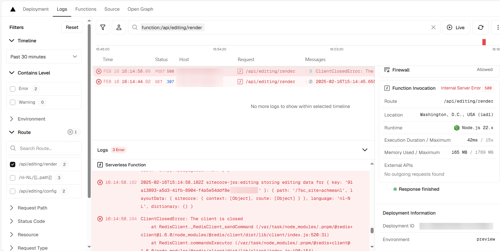

After making the decision to move the editorhost to Vercel, we started to see a lot of `ClientClosed` errors in the logs, especially on the `api/editing/render` endpoint. Not only has the Sitecore documentation some conflicting statements regarding hosting the editorhost on Vercel, whether or not an [out of process cache](https://doc.sitecore.com/xmc/en/developers/jss/latest/jss-xmc/use-an-out-of-process-editing-data-cache-with-vercel-deployments.html) is required, but it also provides code-snippets that are not working out of the box (Sitecore has been notified with the fixes). In this blog post, I will show you how to set up an out-of-process Redis cache for the editorhost on Vercel with Azure Cache for Redis.

## The problem

The pages editor started to show issues when trying to render. Taking a quick look at the vercel logs, the following errors appeared `ClientClosedError: the client is closed`:


## The cause

The original code that Sitecore provided looks as follows:

```typescript
import { createClient, RedisClientType } from '@redis/client';
import { EditingData, EditingDataCache } from '@sitecore-jss/sitecore-jss-nextjs/editing';
import { BasicEditingDataService } from '@sitecore-jss/sitecore-jss-nextjs/editing';

export class CustomRedisEditingDataCache implements EditingDataCache {
  private redisCache: RedisClientType;

  constructor(redisUrl: string) {
    this.redisCache = createClient({
      url: redisUrl,
    });
  }

  set(key: string, editingData: EditingData): Promise<void> {
    return new Promise<void>((resolve, reject) => {
      this.redisCache
        .set(key, JSON.stringify(editingData))
        .then(() => resolve())
        .catch((err) => reject(err));
    });
  }

  get(key: string): Promise<EditingData | undefined> {
    return new Promise<EditingData | undefined>((resolve, reject) => {
      this.redisCache
        .get(key)
        .then((entry) => {
          resolve(JSON.parse(JSON.stringify(entry)) as EditingData);
        })
        .catch((err) => reject(err));
    });
  }
}

const redisUrl = 'YOUR_REDIS_ENDPOINT';
export const redisDataService = new BasicEditingDataService({ 
    editingDataCache: new CustomRedisEditingDataCache(redisUrl) 
});
```

The issue with this code is that the Redis client doesn't make a connection to the Redis server. The Redis client is created in the constructor of the `CustomRedisEditingDataCache` class, but the connection is never made. The fix below explicitly opens and closes the connection for every get and set operation. It is not the most elegant solution, but considering that there is not a major performance impact, and the fact that the get/set operations are sparse, it is a good solution for now. 

In the `set` and `get` functions, the connection is opened before the read/write operations, and a finally block is used to close the connection. This way, we are sure that there is an open connection, which will be closed in any circumstance.

In order to let the code work with Azure Cache for Redis, the connection string should be in the following format: `rediss://<your-redis-endpoint>:6380`. The `rediss` protocol is used to indicate that the connection is encrypted. The port number is 6380, which is the default port for encrypted connections. This is the default setting for Azure Cache for Redis. This can be found on line number 10. 

```typescript
import { createClient, RedisClientType } from '@redis/client';
import { EditingData, EditingDataCache } from '@sitecore-jss/sitecore-jss-nextjs/editing';
import { BasicEditingDataService } from '@sitecore-jss/sitecore-jss-nextjs/editing';
import { config } from '../config';

export class CustomRedisEditingDataCache implements EditingDataCache {
  private redisCache: RedisClientType;

constructor(redisUrl: string, redisPassword: string) {
    this.redisCache = createClient({
      url: `rediss://${redisUrl}:6380`,
      password: redisPassword,
    });
  }

  set(key: string, editingData: EditingData): Promise<void> {
    return new Promise<void>((resolve, reject) => {
      console.log(`set ${key}`);
      this.redisCache.connect();
      this.redisCache
        .set(key, JSON.stringify(editingData))
        .then(() => resolve())
        .catch((err) => reject(err))
        .finally(() => this.redisCache.disconnect());
    });
  }

  get(key: string): Promise<EditingData | undefined> {
    return new Promise<EditingData | undefined>((resolve, reject) => {
      this.redisCache.connect();
      console.log(`get ${key}`);
      this.redisCache
        .get(key)
        .then((entry) => {
          resolve(JSON.parse(JSON.stringify(entry)) as EditingData);
        })
        .catch((err) => reject(err))
        .finally(() => this.redisCache.disconnect());
    });
  }
}

export const redisDataService = new BasicEditingDataService({
  editingDataCache: new CustomRedisEditingDataCache(config.redisUrl, config.redisPassword),
});
```

## Conclusion

Altough Sitecore has an error in their code-snippets, there is an easy fix available to get the external editor host to work with Vercel. 