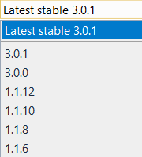
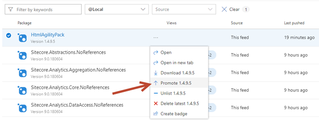

First of all: hands down to Sitecore when they created the nuget feed a while back: it’s really, really convenient to be able to use a nuget feed for all those Sitecore packages, including their dependencies. But we had some issues with the way Sitecore versions it’s packages, the fact that we use multiple versions of Sitecore _and_ the way we wanted to provision our own reusable sitecore-specific nuget packages. Aside from that; our existing nuget-feed was a NAS which had many, many performance issues. In the end we came up with a private nuget feed per Sitecore version which contains all the Sitecore assemblies for that specific version, its dependencies and our own reusable nuget packages for that specific Sitecore version.

[Source can be found on github](https://github.com/BasLijten/get-sitecore-nuget-packages)

# Sitecore versioning

Sitecore versioning on itself is not too bad. When working with Sitecore 9.0 update 1, you basically work with Sitecore 9.0 – revision 171219 – as it was generated on the 19th of December in 2017. When working with nuget, you would _have to know_ that you have to reference the 9.0.171219 version of the nuget packages and not to upgrade to 9.0.2 as it _might_ break things. We still see developers upgrading to the “latest-greatest” version of a package, which would basically put you in unsupported state. This nuget versioning is _in no way_ related to the assembly versioning of Sitecore.

When downloading the Sitecore zip (or web deployment package), it contains all required assemblies. In this package, the Sitecore.Kernel has assemblyversion 11.1.0.0, while Sitecore.Framework.Conditions has assemblyversion 1.1.0.0. Sitecore.EmailCampaign.Analytics does have assemblyversion 6.0.0 and Sitecore.ContentSearch does have assemblyversion 3.1.0.0. They all have a different versioning, which may be related to the functionality; Sitecore probably uses the SymVer method internally.

My expectations on nuget would be that all these assemblies were available under version “9.0.171219”, but it doesn’t look like this is the case. I made a query against _all_ packages, which are 9179 in total. Sitecore 9.0.1 (version 9.0.171219) does have 452 packages, of which 224 are “NoReference” versions.

So what should I do when I would need the Sitecore.Framework.Conditions assemblies for Sitecore 9.0.1? When taking a look at nuget, there are multiple versions:

There is no way I can correlate this to the Sitecore version 9.0.171219 at all. Should I use 3.0.1 as it is the latest version? Or is that version tied to Sitecore 9.0 update 2? Is it safe to use the latest version? Or would I lose my support when using that version?

# Inventarisation of nuget packages and their dependencies

Using a powershell script, I did a query on all sitecore packages. This learned me that those 9179 packages had 106 versions tied to it. Some versions can be correlated to specific Sitecore versions, others can’t.

The next step was to do a query on version 9.0.17129 and it’s dependencies. This leads to the a list which can be found [here](https://github.com/BasLijten/get-sitecore-nuget-packages/blob/master/output/9.0.1-including-dependencies.txt). It gives an overview for all direct dependencies (3rd party and Sitecore) and it’s nuget version that Sitecore refers to. The script which I used can be found [here](https://github.com/BasLijten/get-sitecore-nuget-packages/blob/master/build-flat-dependency-graph.ps1).

In the end, it turned out that there are 306 Sitecore packages and direct depenendies. This knowledge is used to create our own feed!

The dependencygraph of Sitecore is enormous, that I decided just to investigate the first level of dependencies per component. This leads to an enormous graph is well, but it took an acceptable amount of time.

First, make sure that the sitecore-feed has been registered:

\[code lang="powershell"\]Register-PackageSource -Name "sitecore-myget" -Location "https://sitecore.myget.org/F/sc-packages/api/" -ProviderName "nuget"\[/code\]

After registration, the magic (may) happen. First I wrote a recursive script which would get all sitecore packages and its dependencies, all the way down to the very last dependency, but this took _a lot_ of time. So I decided to replace it with only the first level dependencies, which returns “enough” nuget packages.

First, I retrieve _all_ package metadata from the Sitecore myget feed, using the following command:

\[code lang="powershell"\] $packages = Find-Package -Source "sitecore-myget" -AllVersions $packages901 = $packages | where {$\_.Version -eq "$sc\_version" } $packages901WithReferences = $packages901 | where {$\_.Name -notlike "\*NoReferences"} $packages901NoReferences = $packages901 | where {$\_.Name -like "\*NoReferences"} \[/code\]

The next action is to filter all Sitecore 9.0.x versions, in my case this was 9.0.1 (on line 2). In a foreach loop I iterate through all packages which do have references, to install them and get the correct metadata from them.

Using

\[code lang="powershell"\]$pkg = Get-package -Name $Name -RequiredVersion $Version -ErrorAction SilentlyContinue\[/code\]

it can be validated wether or not the package is already installed. If that’s the case, the $pkg is not null and all dependencies can be checked and installed. This installation is important for later upload to VSTS package management. If installation is not required, that line can be disabled.

All dependencies are stored in the form of “parent version.x” -> “child version.y”, for later analysis. When the package does not exist, it has to be looked up in an external feed using

\[code lang="powershell"\]Find-Package -Name $Name -RequiredVersion $Version -Source $Source-ErrorAction SilentlyContinue\[/code\]

When the package has been found, it can be installed to the local packagemanagement storage.

# VSTS package management to the rescue!

With a list of all referenced Sitecore versions, I decided to create a vsts package management feed. It’s not possible to create a direct upstream to Sitecore.myget.org (yet), but there are other ways to fill this feed ([scripts provided here](https://github.com/BasLijten/get-sitecore-nuget-packages/blob/master/build-flat-dependency-graph.ps1)). All of the used Sitecore versions, its dependencies are stored in that feed. VSTS package management contains a nice feature, called “[Views](https://docs.microsoft.com/en-us/vsts/package/concepts/views?view=vsts)”. Its normal use is to create several feeds which say anything about the stability of a package (alpha, beta, pre-release, release). When a package has been added to the pre-release feed, it doesn’t show up in the release view (yet) ; This package has to be promoted to the “release” view (which can be done manually or using code. We used the same technique for Sitecore. The difference here is, is that we use the views to reference the correct set of Sitecore nuget packages and its dependencies, instead of using them for its “stability-level”:

When taking a look at the “default” view, a list of all the latest Sitecore versions is visible:

Please take notice of the “HtmlAgilityPack”, as it doesn’t have a view specified, while the “Sitecore.Abstractions.NoReferences” package has version “9.0.180604” and the view “@Release-9.0-update-2” specified. I also uploaded the “9.0.191217” version, but as it has a lower version in this “Local” feed, it’s not directly visible.

When taking a look at the the versioninfo,  both versions can be seen:

When taking a look at the View “Release-9.0-update-1”, the 9.0.180604 version is missing; only the 9.0.171219 version is available in here. Please take note of the HtmlAgilityPack; it’s not available at all in this feed:

Using the User interface, packages can be promoted to different views:

In this “Promote this package” window, the correct view can be selected:

After selecting the view, the package has been made available to that specific view, which is available as a regular nuget feed.

This feed contains all the relevant packages for the Sitecore version and its dependencies. We decided to provision our generic components to this feed as well, so every building block for a certain version, is available from that feed. Our developers will not be able to (accidentally) upgrade to a version that is not supported.

From a Visual Studio client, the nuget package management displays the following package versions for the Sitecore.Abstractions.NoReferences package. At the left, the “general” feed is shown, at the right, the two specific views for Sitecore 9.0 update-1 and Sitecore 9.0 update-2:

## Upgrading your code to a new version

This approach makes upgrading to "a" version a blast. By changing your Sitecore feed to the "new" Sitecore version feed (from 9.0.1 tot 9.0.2), all you have to do is upgrading all packages at once and you are (or should) be ready to go:

# Summary

Sitecore versions may lead to unwanted actions by developers (for example, upgrading to the latest sitecore version where you are still running 8.2) and in a lot of cases it's just unclear what version of a package to use. After analyzing the Sitecore feed, its versions and depedencies, we came up a list of all packages that are "tied" to a certain sitecore version. To make it more convenient for our developers, we decided to create an own sitecore feed, with all Sitecore nuget packages _and_ their dependencies, and made just the small subset of packages which are "tied together" available through different views on this nuget feed.
