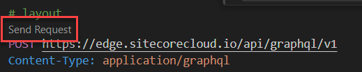
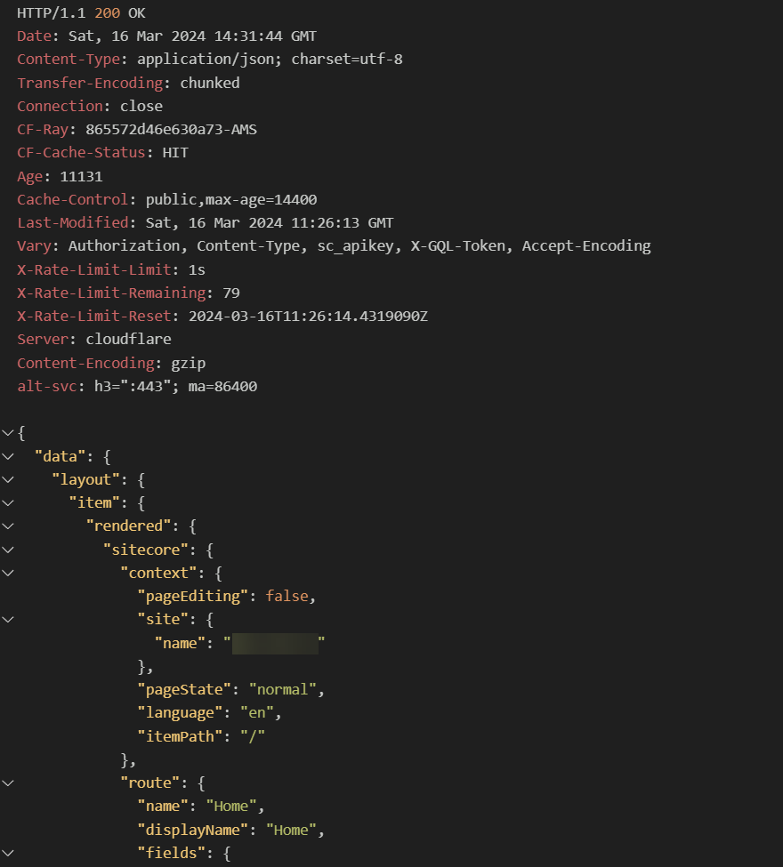
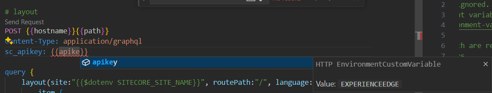
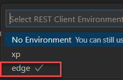

When building for Sitecore Experience Edge, or Sitecore XM/XP using the one of the graphQL queries, it often is mandatory to find out what kind of data the queries returned to the client. While there is an excellent IDE available to build and test queries, it is often a hassle to copy, paste and modify the queries, copy over the api-keys and, in my case, finding the right url's to work with. For XP and XM environments, these paths are diffent in comparison to the Experience Edge environment. THis blogpost explains how I use the REST Client extension in vscode to quickly test and modify graphQL queries.

## The REST Client extension

The rest Client extension for vscode is a tool to test and run http requests. [This extension](https://marketplace.visualstudio.com/items?itemName=humao.rest-client) can be installed from the marketplace. Once installed, you can create a new file with the extension `.http` and start writing your http requests.

## Anatomy of a http request

The `.http` file is a simple text file with a comment with the name of the request to run, followed by an a new line with an action defined. Per new line a new header can be specified, followed by a body. An example of a simple http request which makes a graphql query on the experience edge is shown below:

```http
# layout
POST https://edge.sitecorecloud.io/api/graphql/v1
Content-Type: application/graphql
sc_apikey: apikey

query {
    layout(site:"jss-site-name", routePath:"/", language:"en") {
        item {
            rendered
        }
    }
}
```

When the extension is installed correctly, a small action button with the text `Send Request` will appear below the name:



When clicking this button, the request will be sent to the server and the response will be shown in the output window of vscode. This is a quick and easy way to test and modify graphQL queries:



## parameterization of the requests

I often fall back on default queries, which are used over multiple environments, and sometimes I have to switch from the experience edge to XP/XM or the other way around. As I always struggle to find the right url's, this costs me a lot of time. And aside from that: storing api keys in your http file is a bad practice, as they are stored into git, which is a security risk. To solve this, variables can be used!

Various approaches are feasable here: you can use the `settings.json` file to store your variables, or you can use the `.env` and `.env.local` files, or even a combination of those.

Let's take a look at the query above, but now with variables. When wanting to work with queries which work on XM/XP and Experience Edge, there are a few parameters which are different:

| parameter          | Experience Edge                   | var-location    | XM/XP                             | var-location    |
| ------------------ | --------------------------------- | --------------- | --------------------------------- | --------------- |
| hostname           | https://edge.sitecorecloud.io     | `settings.json` | any hostname                      | `settings.json` |
| path               | `/api/graphql/v1`                 | `settings.json` | `/sitecore/api/graph/edge/`       | `settings.json` |
| apikey             | secret, env-specific              | local machine   | secret, env-specific              | local machine   |
| SITECORE_SITE_NAME | same, but different over projects | `dotenv`        | same, but different over projects | `dotenv`        |

When using the variables, the query would look as follows:

```http
# layout
POST {{hostname}}{{path}}
Content-Type: application/graphql
sc_apikey: {{apikey}}

query {
    layout(site:"{{$dotenv SITECORE_SITE_NAME}}", routePath:"/", language:"en") {
        item {
            rendered
        }
    }
}
```

When building requests, there is even auto-completion available for the variables, which makes it even easier to work with:



For the observant readers: the apikey has the value "EXPERIENCEEDGE", and not the actual apikey. As this is a secret, which should not be stored in git, it is stored as a local machine environment variable. Let's take a look at the settings.json to see how this works:

### settings.json

My `settings.json` looks as follows:

```json
{
  "rest-client.environmentVariables": {
    "$shared": {},
    "xp": {
      "hostname": "https://xp.local",
      "path": "/sitecore/api/graph/edge/",
      "apikey": "XPSECRET"
    },
    "edge": {
      "hostname": "https://edge.sitecorecloud.io",
      "path": "/api/graphql/v1",
      "apikey": "EXPERIENCEEDGE"
    }
  }
}
```

Per environment, I maintain a separate configuration. The apikey refers to the local machine environment variable. This one can be stored with the following command: `export EXPERIENCEEDGE=your-secret-key`. The only action that is needed, is to switch environments when needed:

The combination `CTRL+ALT-E` is the shortcut to switch between environments. Every configured environment is shown in the dropdown:



### Conlcusion

Using the rest-client, you can store common queries in git and by using variables, you can easily switch between environments. This is a great productivity boost, as you can quickly test and modify queries. The auto-completion for the variables is a great feature, as it helps you to quickly build queries. When making use of the environment variables, it is even secure, as the secrets won't show up in git.
