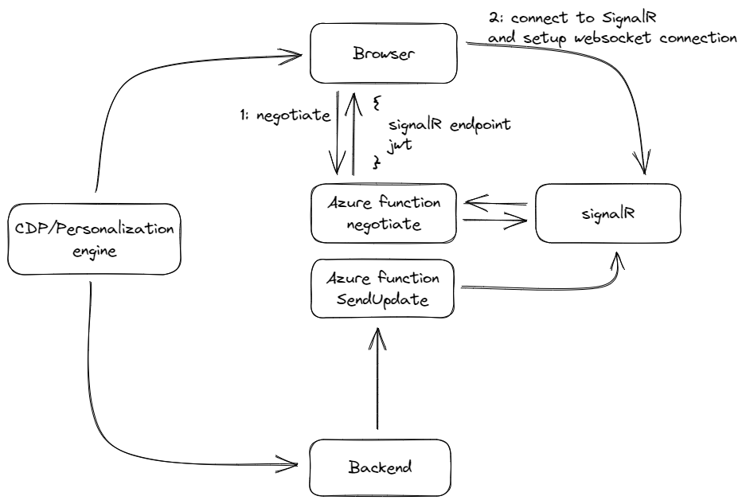

SignalR is a great service provided by Microsoft, which enables to send updates to a browser from a server through the websocket protocol. A great usecase is to use this technique to personalize the web experience, [I spoke about this subject](https://www.youtube.com/watch?v=zT2uT1zSGuE) years ago, however, I never blogged about this subject. This blogpost will just be a short blogpost about setting a unqiue userid, which can be used by your personalization/decision engine to notify a connected client with an update whenever there is one available.

> Warning: While the concepts in this blogpost are still relevant, the information regarding custom headers is outdated. A small blogpost with an update can be found at: [An update on setting the SignalR UserID without authentication](../an-update-on-setting-the-signalr-userid-without-authentication)


> Disclaimer: In order to use personalization, track users, or whatsoever, you might or might have to obey your national regulations. Please consult your legal department ;)


## Architecture

In this specific example, 5 main actors exist, for the sake of simplicity. 

Actor | description
--- | ---
Browser |  renders page, connects to signalR, needs to act on signalR updates
Azure SignalR | serverless signalR service which handles communication from the backend *to* the browser
Azure Functions | negotiates connection between client/signalR and provides an abstraction to send messages from server to signalR
CDP / Personalization engine | hands out a unqiue (user)ID to a browser and registers it to the backend, triggers personalization actions
Backend | required to send updates to the browser (via signalR)



## Back to the basics: a regular browser-signalR setup

In a regular anonymous, serverless scenario, a browser doesn't subscribe to SignalR itself, but through an Azure function, as a (secret) accesstoken is needed in order to be able to connect to signalR. As this accesstoken is secret, it shouldn't be provided to the browser; here is where the azure "negotiate" function comes in. This one is anonymously accessible and handles the negotiation between the browser and signalR. In most examples found on the web, no userID is provided, and after the negotiation phase, a response is being returned with a signalR endpoint and a unique, personal jwt token. this token is used to identify the browser to the signalR service.

```json
{
  "url": "https://xxx.service.signalr.net/client/?hub=serverless",
  "accessToken": "eyJhbGciOiJIUzI1NiIsImtpZCI6IjExOTg2MDcyOTMiLCJ0eXAiOiJKV1QifQ.eyJh..<snip>..WI9c2VydmVybGVzcyJ9.t2JEGomrl4h-YAwyrfqisVehYbIMqMf6_MadMUUj3pU"
}
```

the jwt token contains the following information:

```json
{
  "alg": "HS256",
  "kid": "-1521035073",
  "typ": "JWT"
}.{
  "nbf": 1677161721,
  "exp": 1677165321,
  "iat": 1677161721,
  "aud": "https://xxx.service.signalr.net/client/?hub=serverless"
}.[Signature]
```

the JWT token doesn't contain any information about the user, and is just used for authentication towards the signalR service. Once a connection has been setup, broadcast messages or connection specific messages can be send via signalR to the client, but user specific messages aren't possible anymore

### How a userID can be set, based on most examples
In order to be able to send specific messages towards "users" (well, browsers with users with a specific ID, to be clear ;), the UserID has to be set during the negotiation phase. There are existing examples on the web, but they are all based on authentication methods using github, facebook, microsoft and they expect to have a specific header in order to be able to use it. On [learn.microsoft.com](https://learn.microsoft.com/en-us/azure/azure-signalr/signalr-concept-serverless-development-config#using-app-service-authentication) examples can be found how this exactly should work. A small summary:

* Your application must run on an app , making use of the platform [authentication and authorization features](https://learn.microsoft.com/en-us/azure/app-service/overview-authentication-authorization) which are available. This wil result in two headers becoming available during every http request:
`x-ms-client-principal-name` and `x-ms-client-principal-id`. These headers are automatically in all traffic between the negotiation function and the browser (as it is default behaviour of the http protocol). The negotiation function can be setup in order to use one of these headers as a userid:

```csharp
[FunctionName("negotiate")]
public static SignalRConnectionInfo Negotiate(
    [HttpTrigger(AuthorizationLevel.Anonymous)]HttpRequest req,
    [SignalRConnectionInfo
        (HubName = "chat", UserId = "{headers.x-ms-client-principal-id}")]
        SignalRConnectionInfo connectionInfo)
{
    // connectionInfo contains an access key token with a name identifier claim set to the authenticated user
    return connectionInfo;
}
```

Using a binding experssion, the UserID parameter is set to the header `x-ms-client-principal-id`

## Why this method doesn't work for in all situations

There are a few situations where the approach above doesn't work, one of them is, of course, when there is not authentication header available. As seen in the explanation above, a header is used to determine the userID. A simple solution would be, to add this header yourself, but it is not as easy as it seems, as the HubConnectionBuilder can't add custom headers. Although there is an option so set the `headers` object, it is ignored

> As mention in the topic start: the information on custom headers isn't correct anymore; the `HubConnectionBuilder` accepts custom headers nowadays

A connection setup in the browser works as follows:

```javascript
    const connection = new signalR.HubConnectionBuilder()
        .withUrl(apiBaseUrl + '/api')
        .configureLogging(signalR.LogLevel.Information)
        .build();    
```


## Obtaining an User ID
The first import step is to acquire a userid. A lot of signalR examples do use some kind of authentication in order to acquire a UserID, but, especially on commercial websites, people often don't log in. Most of the SignalR examples, which explain how user specific updates work, do require some kind of authentication. Information from this token is being used by SignalR in order to be able to send specific updates to a user. As we are working with anonymous users, this is not an option. As a lot of websites, however, do track users, the UserID of the CDP could be used, but how could it be Send to SignalR?

Let's assume that a Unqiue ID has been assigned using your CDP as `customUserId`

the following code could be used in order to transfer the customUserID to the negotiate function:

```javascript
const apiBaseUrl = window.location.origin;
const connection = new signalR.HubConnectionBuilder()
    .withUrl(apiBaseUrl + '/api?userid=' + customUserId)
    .configureLogging(signalR.LogLevel.Information)
    .build(); 
```
However, this would to an exception, as the function still expects the `x-ms-client-principal-id` header to be present. A small change to the binding expression (from `headers.x-ms-client-principal-id` to `query.userid`) solves this issue, and the querystring parameter is taken automatically as UserId

```csharp
[FunctionName("negotiate")]
public static SignalRConnectionInfo Negotiate(
    [HttpTrigger(AuthorizationLevel.Anonymous)]HttpRequest req,
    [SignalRConnectionInfo
        (HubName = "chat", UserId = "{query.userid}")]
        SignalRConnectionInfo connectionInfo)
{
    // connectionInfo contains an access key token with a name identifier claim set to the identified user
    return connectionInfo;
}
```

## The result

Running the code would result into a working setup without an authenticated user and with a unique userID. Let's assume that the UserID has been set to `bas`, this would result into the following result of the negotiation result:

```json
{
  "url": "https://xxx.service.signalr.net/client/?hub=serverless",
  "accessToken": "eyJhbGciOiJIUzI1NiIsImtpZCI6IjQ3MTIwMjM3MSIsInR5cCI6IkpXVCJ9.eyJhc3JzLnMudWlkIjoiYmFzIiwib..<snip>..0xLnNlcnZpY2Uuc2lnbmFsci5uZXQvY2xpZW50Lz9odWI9c2VydmVybGVzcyJ9.Hb8qkf3i3uwdwRNKyyILJZwxMV90yRxiFYSZqLUbSFk"
}
```

The actual contents of the accesstoken can be found in the snippet below. In the body of this token, an identifier is now available, which is used by signalR to identify the user. The key is `asrs.s.uid` and the value `bas` has been assigned by SignalR

```json
{
  "alg": "HS256",
  "kid": "471202371",
  "typ": "JWT"
}.{
  "asrs.s.uid": "bas",
  "nbf": 1677246044,
  "exp": 1677249644,
  "iat": 1677246044,
  "aud": "https://xxx.signalr.net/client/?hub=serverless"
}.[Signature]
```