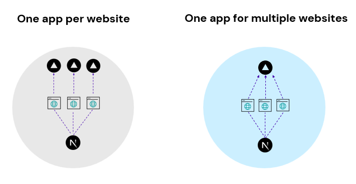
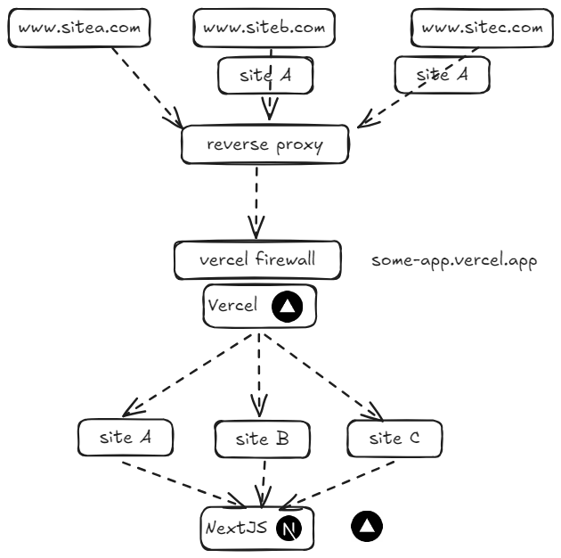
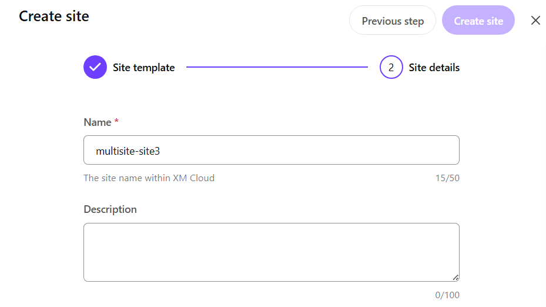
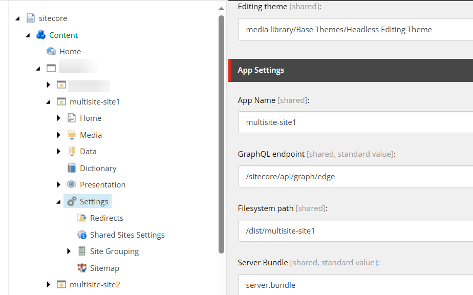
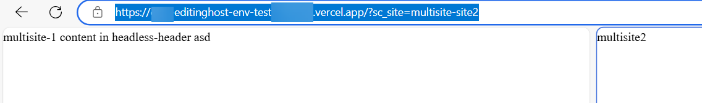
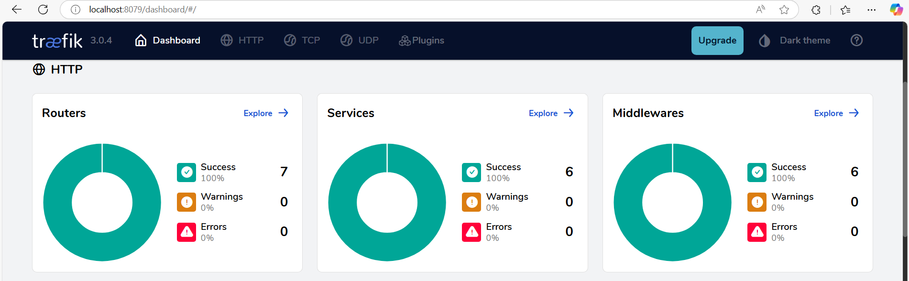
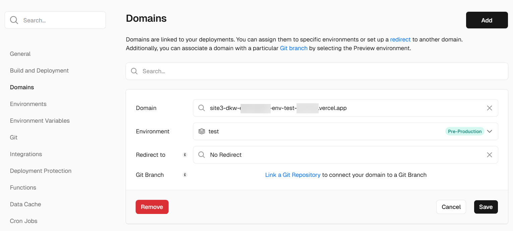
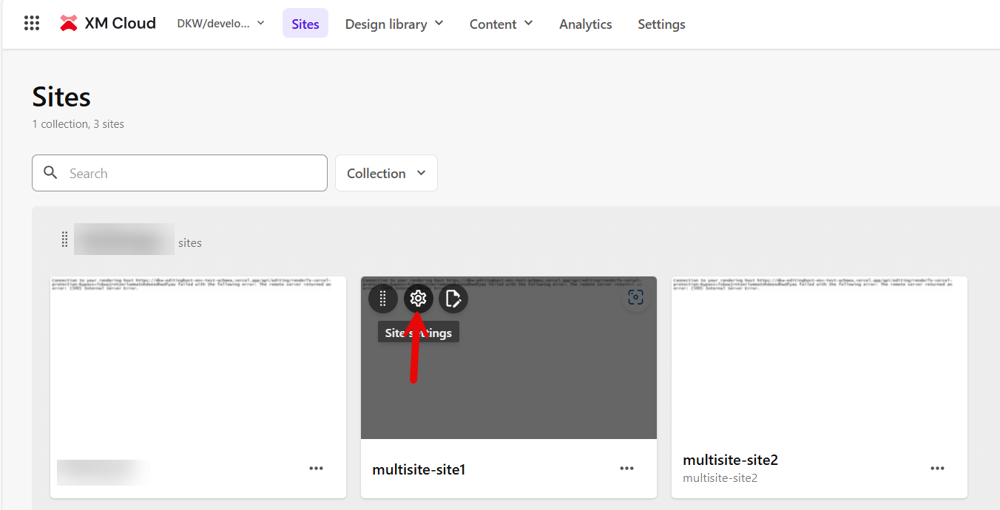
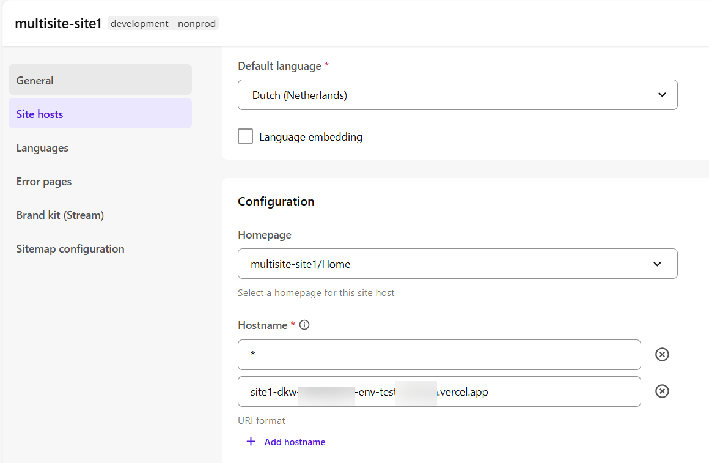
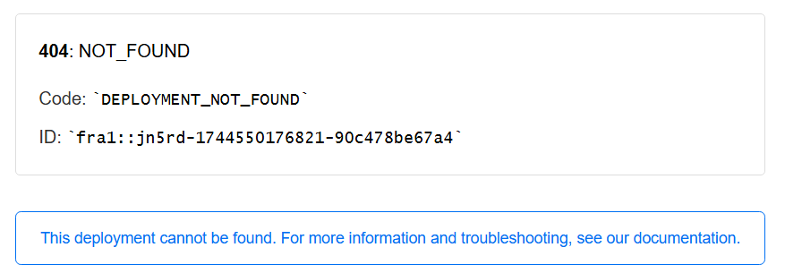

Building and hosting the Sitecore head can be done in various ways, and based on your requirements a choice should be made. The [following article](https://developers.sitecore.com/learn/accelerate/xm-cloud/pre-development/project-architecture/multisite) in the Sitecore Architecture Cookbook describes various considerations on this topic. It basically comes down to a choice for how you would organize sites in xm cloud and your preferred choice of hosting the frontend. When working with [NextJS](https://nextjs.org), sitecore offers a [multisite addon](https://doc.sitecore.com/xmc/en/developers/jss/22/jss-xmc/the-next-js-multisite-add-on.html), it basically offers functionality to expose multiple sites from a single deployment with NextJS:



When hosting your projects on vercel, things might get a bit complicated. Out of the box, vercel supports hosting up to 50 domains, as the [following article](https://vercel.com/docs/domains/working-with-domains/add-a-domain) describes, but when introducing an own reverse proxy and firewall, things get a bit more complex. That architecture might look like this (simplified). 



Especially an own reverse proxy, the vercel firewall and image optimization, can be a challenge to setup, and in my opinion, it should be done as soon as possible in a project. In order to be able to test this setup, quite a bit configuration is needed. Often, when running these kind of setups, the corporate firewall/reverse proxy is being configured by other people than the developers, so it might be hard to test and solve specific situations. That is a single reason why this setup is valuable to a Sitecore developer ;).

> using the sitecore multisite middleware has advantages and disadvantages. This article will not cover these, it is all about "how to get the traffic flow working in a complex scenario". It doesn't mean it works correctly. Things will break, which have to be solved and I might touch these subjects in a later blogpost. The only thing I *really* want to mention, is that, when using this approach, the middleware will *always* trigger, which might lead to a higher spend in vercel.

## Configuring Sitecore

Sitecore XM cloud offers, with SXA, out of the box configuration for multiple sites. When creating a new site, this site gets a specific name:



and it ends up under of the sitecollections within the /sitecore/content node:



When visiting the deployed app on vercel, the site can be changed by specifying the sc_site querystring parameter:



## Configuring a reverse proxy with Traefik

To setup a reverse proxy, some configuration is needed. At first, you *need* a reverse proxy. In this case, I chose to use the proxy that Sitecore ships with for local development, called traefik. The reason behind this, is that it is very easy to extend this proxy and all prerequisites that are needed to test, are being handled during the initialization of your local container setup.

During the initialization of the local container setup, sitecore generates a wildcard certificate for your local setup, and binds this to traefik. First, based on the projectname, a rendering hostname in the form of `project_name.localhost` gets created, followed by setting the `www.project_name.localhost` domain

```powershell
# Get Project name from .env file
$project_name = Get-EnvFileVariable -Path $envFileLocation -Variable "COMPOSE_PROJECT_NAME"
$renderingHostName = "$project_name.localhost"
$nextjsHostName = "www.$renderingHostName"
```

later, a wildcard certificate for this renderinghostname gets created `*.project_name.localhost`

```powershell
Write-Host "Generating Traefik TLS certificate..." -ForegroundColor Green
    & $mkcert -install
    & $mkcert "*.$renderingHostName"
    & $mkcert "xmcloudcm.localhost"
```
and in the end, the environment variable is stored

```powershell
 # RENDERING_HOST
 Set-EnvFileVariable "RENDERING_HOST" -Value "$nextjsHostName" -Path $envFileLocation
```

In the docker compose setup, this specific `RENDERING_HOST` variable will be bound to the rendering host service. Take note of the labels-section. Here, docker gets configured in such a way, the rendering-host parameter is bound to this service, while configured on the traefik middleware. The fun part is that there is an explicit configuration for www.project_name.localhost, while there is a wildcard certificate available, which can be used for basically anything.

```yaml
 rendering:
    image: ${REGISTRY}${COMPOSE_PROJECT_NAME}-rendering:${VERSION:-latest}
    build:
      context: ./docker/build/rendering
      target: ${BUILD_CONFIGURATION}
      args:
        PARENT_IMAGE: ${REGISTRY}${COMPOSE_PROJECT_NAME}-nodejs:${VERSION:-latest}
    volumes:
      - ../headapps/vnext:C:\app
    environment:
      SITECORE_API_HOST: "http://cm"
      NEXTJS_DIST_DIR: ".next-container"
      PUBLIC_URL: "https://${RENDERING_HOST}"
      JSS_EDITING_SECRET: ${JSS_EDITING_SECRET}
      SITECORE_API_KEY: "${SITECORE_API_KEY_NEXTJS_STARTER}"
      DISABLE_SSG_FETCH: ${DISABLE_SSG_FETCH}
    depends_on:
      - cm
      - nodejs
    labels:
      - "traefik.enable=true"
      - "traefik.http.routers.rendering-secure.entrypoints=websecure"
      - "traefik.http.routers.rendering-secure.rule=Host(`${RENDERING_HOST}`)"
      - "traefik.http.routers.rendering-secure.tls=true"
```

### configuring traefik to point to vercel

There are a few steps involved to set this up. Let's try to forward traffic to vercel. aside for the docker compose configuration, extra configuration can be added to `project\local-containers\docker\traefik\config\dynamic\certs_config.yaml`. Within the SItecore scaffold, this file is intended to be used for the certificate management, but extra configuration can be added. But let's take a look at the basic architecture of traefik. When opening the traefik dashboard on [http://localhost:8079/](http://localhost:8079/), three main graphs are shown: Routers, services and middlewares



* Router is intended as entrypoints for traffic
* middleware is intended to transform this traffic
* service is intended as destination for this traffic 

What we want to achieve, is to forward traefik from a local domain, to vercel. Let's take the domain `site1-vercel.dkw.localhost`, as I had configured as my wildcard domain. It should point to vercel. This can be done applying the following configuration.

```yaml
http:
  routers:
    site1:
      entrypoints: websecure
      tls: true
      rule: Host(`site1-vercel.dkw.localhost`)
      service: forward
  services:
    forward:
      loadBalancer:
        servers:
          - url: https://dkw-some-vercel-project.vercel.app/
```

#### Challenges

##### Deployment protection

The first challenge to overcome, is (probably) an authentication challenge, as Vercel requires non-production environments to authenticate. When this is not solved, than you will be redirected to the targeturl, instead of sending traffic through this reverse proxy. This can be bypassed to configure the `x-vercel-protection-bypass=<secret>` querystring, but as this is at least inconvenient, as it would have to be provided for every request, another solution should be used.

This solution is by sending configuring the `x-vercel-protection-bypass` header in traefik. It basically sends this header with every request to vercel, in order to bypass this deployment protection. In the configuration below, the middleware `addSite1Host` has been added to the configuration, which defines this middleware. The site1 configuration under routers has been updated to point to this middleware.

```yaml
http:
  routers:
    site1:
      entrypoints: websecure
      tls: true
      middlewares:
        - addSite1Host
      rule: Host(`site1-vercel.dkw.localhost`)
      service: forward
  
  middlewares:
    addSite1Host:
      headers:
        customRequestHeaders:
          x-vercel-protection-bypass: <secret>

  services:
    forward:
      loadBalancer:
        servers:
          - url: https://dkw-some-vercel-project.vercel.app/
```

It looks like everything works, but the multisite setup doesn't work yet. A second domain will be added, and has to point to this single vercel project at `https://dkw-some-vercel-project.vercel.app/`. The nextjs application needs to be able to be told what site it should serve.

##### Targeting the right site

Next part is to target the right site. by visiting ```site1-vercel.dkw.localhost``` the default site is targeted. To target another site, the ```sc_site``` querystring parameter could be used: ```https://site1-vercel.dkw.localhost?sc_site=site2```. This approach is not convenient: for development purposes, it is a repetitive task, and of course no production-like scenario. Another solution should be chosen.

## How to configure vercel and Sitecore in order to support multiple domains

In the example below is explained how to configure Sitecore and vercel, in order to support multiple domains with a single codebase

### Configure vercel

when a project in vercel is created, all environments are accessible by unique subdomains, in the form of:

```<projectname>-env-<environmentname>-<teamslug>.vercel.app``` and ```<projectname>-<deploymentid>-<teamslug>.vercel.app```

it is *also* possible to add extra domains to make these environments accessible. In the example below, I chose to configure an extra domain and point it to the test environment.



when not changing any configuration in Sitecore, this domain will point to the default site. This behaviour can easily be changed within Sitecore xm cloud

### Configure Sitecore

In sitecore, navigate to the site settings:



followed by the site hosts 



When the domain has been added which was created in vercel, the sitecore middleware will serve the correct site.

## When a plan comes together - traefik revisited

A working custom domain in vercel was configured, and sitecore has been configured to serve the correct site when navigating to that host. The last part is to add our reverse proxy, and configure it in such a way, that our custom domain *also* works. Pointing this proxy to the custom domain however, does *not* work. You will probably get the following error:

```
404: NOT_FOUND
Code: DEPLOYMENT_NOT_FOUND
```



### configuring the hostname using the host-headered site approach.

This should be solved by adding a host in the traefik middleware. When this doesn't happen, then traefik will launch a request to vercel for the original domain. This domain and deployment exists, but the specified hostname ```site1-vercel.dkw.localhost``` does - of course - *not* exist. This piece of middleware tells vercel: `although I am requesting some custom domain name, the real hostname that I am looking for is ```custom-vercel-domain-name```, which *does* exist.

```yaml
  middlewares:
    addSite1Host:
      headers:
        customRequestHeaders:
          x-vercel-protection-bypass: <secret>
          host: <custom-vercel-domain-name>.vercel.app
```

The sitecore middleware plugin tries to extract the "host" header, which has been supplied by "traefik". This value will be checked against the site configuration, and if it is available, to correct "sitename" will be configured. As we configured this hostname on Sitecore, the correct site should be rendered.

*I only pasted the relevant code*

```typescript
private handler = async (req: NextRequest, res?: NextResponse): Promise<NextResponse> => {
    const pathname = req.nextUrl.pathname;
    const language = this.getLanguage(req);
    const hostname = this.getHostHeader(req) || this.defaultHostname;
    const startTimestamp = Date.now();

    // Response will be provided if other middleware is run before us
    let response = res || NextResponse.next();

    // Site name can be forced by query string parameter or cookie
    const siteName =
      req.nextUrl.searchParams.get(this.SITE_SYMBOL) ||
      (this.config.useCookieResolution &&
        this.config.useCookieResolution(req) &&
        req.cookies.get(this.SITE_SYMBOL)?.value) ||
      this.config.siteResolver.getByHost(hostname).name;

    // Rewrite to site specific path
    const rewritePath = getSiteRewrite(pathname, {
      siteName,
    });
    response = this.rewrite(rewritePath, req, response);
```

## Conclusion

Setting up a multisite architecture with Sitecore and Vercel's reverse proxy isn't straightforward. At first glance, it might seem like a complex puzzle. However, by dissecting each component—middleware for hostname resolution, media path rewrites, and environment-specific configurations—the overall picture becomes clearer. Through this exploration, we've demystified the setup, transforming it from a daunting task into a manageable implementation.