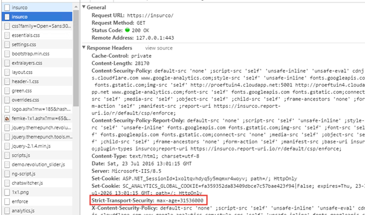

Secure connections? Why would I even bother? It’s expensive, slow, complex and I’ve got a firewall anyway? On the SUGCON in Copenhagen I showed off how easy it is to intercept, modify and redirect unencrypted traffic and what can be done against this threat. This blogpost is all about why you should serve your website _always_ and _fully_ over HTTPS and how the browser can be forced to use this HTTPS connection. This blogpost will _not_ show off how to configure HTTPS and will not tell about _[all the benefits](https://www.troyhunt.com/i-wanna-go-fast-https-massive-speed-advantage/)_ of https. The technique to achieve this is bu adding a HSTS header for your domain, [google recently announced](https://security.googleblog.com/2016/07/bringing-hsts-to-wwwgooglecom.html) that they will introduce this for the complete www.google.com domain as well!

 

Note: Some other [great articles](https://www.troyhunt.com/understanding-http-strict-transport/) have been written about this subject, but I intentionally wrote this article to reach out the Sitecore (and SharePoint) community!

The configuration is included in the blogpost below, it will also be released as a XDT as part of a bigger security project

# It’s not only about the login page

As the Sitecore hardening guide describes:

Make the login page available only to SSL requests

This is **_not_** true. This guideline suggests that the login page is the _only_ page taht needs to be exposed via https, but e_very_ page should be served over SSL. And when SSL is mentioned, the technique that should be spoken about is TLS, Transport Layer Security. SSL is completely insecure, while TLS is the improved version of SSL and is nowadays on version 1.2.

Why is this _not_ true? When people are connected to insecure Wi-Fi networks data can often easily be sniffed, which means, all traffic can be captured by other devices. This means that all the data that flows over the (virtual) wire, can be captured. When the data is send over HTTP, this data is unencrypted and can by the persons who are capturing this traffic. Personal interests, details, and-so-forth can be captured. Imagine what happens when login credentials would be send over HTTP?

Things get even worse, when someone manages to intercept the connection, which is called a “Man in the Middle”. This person would be able to intercept the traffic, monitor it, transform it or even redirect it to another location, while the visitor wouldn’t have _any_ indication on what’s currently happening.

During my session on the SUGCON in Copenhagen, I brought a small device with me which is called a “rogue access point”, which tries to trick devices to automatically connect to this wireless access point. See what happened in a few minutes, before my session even started and almost no visitors were in the room:

<blockquote class="twitter-tweet" data-lang="en"><p dir="ltr" lang="en">You have been <a href="https://twitter.com/hashtag/robbertHACK?src=hash">#robbertHACK</a> 'ed- <a href="https://twitter.com/hashtag/SUGCON?src=hash">#SUGCON</a> <a href="https://twitter.com/BasLijten">@BasLijten</a> <a href="https://twitter.com/seanholmesby">@seanholmesby</a> - ps I removed the Mac address- you r welcome! <a href="https://t.co/qS9dBbkK6m">pic.twitter.com/qS9dBbkK6m</a></p>— Akshay Sura (@akshaysura13) <a href="https://twitter.com/akshaysura13/status/724599867218100226">April 25, 2016</a></blockquote>
<script src="//platform.twitter.com/widgets.js" async charset="utf-8"></script>

# But my credentials are posted over HTTPS, right?

That’s true. That _might_ be true. But at the moment that someone would be able to intercept the initial request for serving the loginpage, which would be over HTTP, that person would be able to alter or redirect _that_ request and prevent the initial request from ever landing on it’s initial destination:

[](http://blog.baslijten.com/wp-content/uploads/2016/07/MITM.png)

I could redirect traffic to any site, fishing email, passwords, et cetera.

# Forcing the browser to use HTTPS

To prevent this kind of attack, even the initial request, must be send over HTTPS. Most visitors enter the address of the website that they want to visit in their browser:

[www.website.com](http://www.website.com)

mention that _no_ protocol has been specified. Browsers initially send this request over HTTP and BAM: you’re vulnerable.

To solve this, the “Strict-Transport-Security” header can be used. When this header has been set, the browser will know that they should _never_ visit that website over HTTP, but always use the HTTPS variant of the address. Pretty much [all major browsers](http://caniuse.com/#feat=stricttransportsecurity) support this header.

## Trust On First Use (TOFU)

Please note that this solution is a TOFU-solution – Trust-On-First-Use. When you have never, ever visited this website, it’s very likely that the website will be requested over HTTP - At this part, the visitor still vulnerable and the request could be intercepted/altered/redirected.  But let’s assume that this first request is safe.

## Setting the Http Strict-Transport-Security header (HSTS)

After this initial request, The website should 301-redirect the request immediately to the https-equivalent, together with the following header: Strict-transport-security: max-age=31536000. The browser will cache this value and now knows that for every request, even if it has been initiated over http, the secure equivalent has to be used.

To show off what exactly happens, I included that images below:

#### The inital request

\[caption id="attachment\_18941" align="alignnone" width="605"\] The initial request is over http and responds with a 301 -> https://insurco\[/caption\]

#### The page gets redirected

\[caption id="attachment\_18951" align="alignnone" width="605"\] The page that is served securely, has the strict-transport-security header added to the response\[/caption\]

#### The next time the user tries to visit the webpage over http

\[caption id="attachment\_18961" align="alignnone" width="605"\] An internal redirect (status code 307) to the secure page, no network traffic is involved in this step\[/caption\]

# Cool, I want this, how do I do that?

First, a secure connection is needed. After that one, you can configure your proxy to inject this header on every request, or configure the IIS Rewrite module of Microsoft Internet Information Server to use this one. My advice would be to configure this rule on the the proxy, but I you don’t have any access to this proxy or it takes too long, it’s also possible to configure IIS using the following rule. It forces the website to be visited over https and sends the Strict transport security header along with it.

```xml
&lt;rewrite&gt; &lt;rules&gt; &lt;rule name="Http Redirect to HTTPS" enabled="true" stopProcessing="true"&gt; &lt;match url="(.\*)" ignoreCase="true" /&gt; &lt;conditions logicalGrouping="MatchAny"&gt; &lt;add input="{HTTPS}" pattern="off" ignoreCase="true" /&gt; &lt;/conditions&gt; &lt;action type="Redirect" url="https://{HTTP\_HOST}/{R:1}" appendQueryString="true" redirectType="Permanent" /&gt; &lt;/rule&gt; &lt;/rules&gt; &lt;outboundRules&gt; &lt;rule name="Add Strict-Transport-Security when HTTPS" enabled="true"&gt; &lt;match serverVariable="RESPONSE\_Strict\_Transport\_Security" pattern=".\*" /&gt; &lt;conditions&gt; &lt;add input="{HTTPS}" pattern="on" ignoreCase="true" /&gt; &lt;/conditions&gt; &lt;action type="Rewrite" value="max-age=31536000" /&gt; &lt;/rule&gt; &lt;/outboundRules&gt; &lt;/rewrite&gt; ```

 

# Securing the Initial request

It is possible, for several browsers, to secure the initial request as well. Most major browsers work with a HSTS preload list. A domain can be submitted to this list on https://hstspreload.appspot.com/ which will put into the preload list of all browsers.

## Be cautious! Things may break!

This preload list requires a very important setting for the preload list: _includeSubdomains._ This setting forces that _every_ subdomain should be served over https as well. If any subdomains exist that are only accessible over HTTP, they will break.

# Summary

Serving sites over HTTP is _not_ safe. Although you might only serve content, attackers may use unsafe connections to inject malicious forms, redirect requests, phish usernames and passwords. To force browsers (and thus, their users) to connect over HTTPS, the Strict-Transport-Security header should be used.
