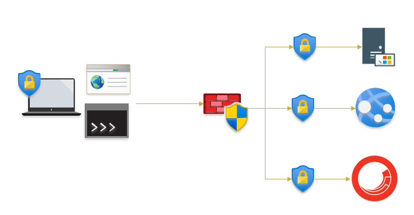
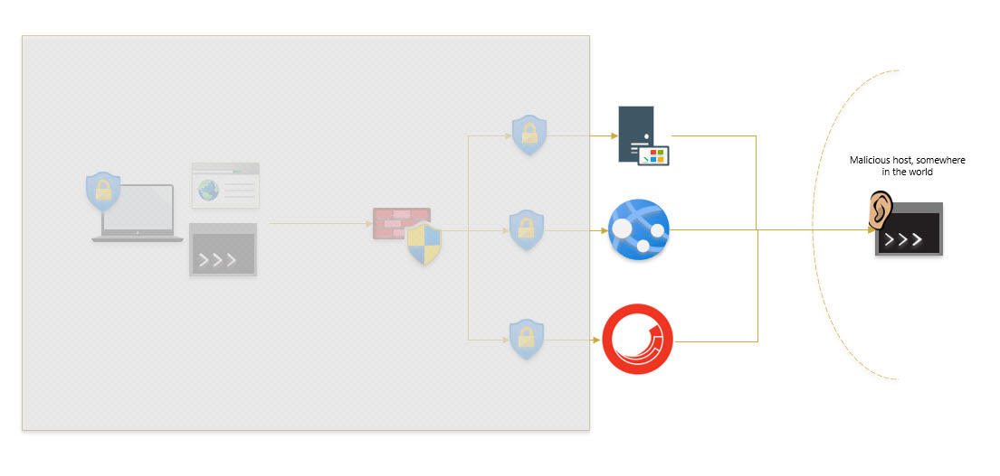
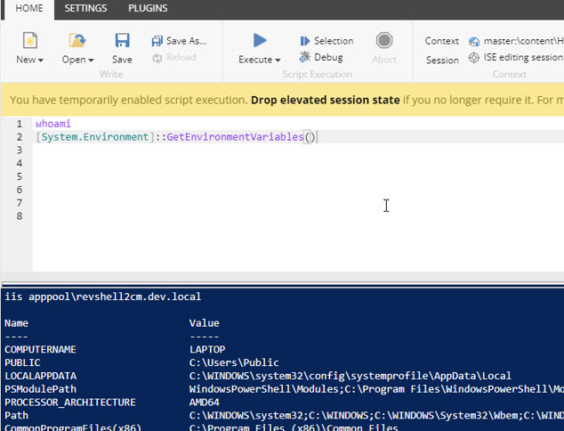
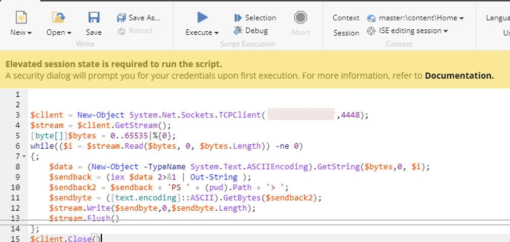
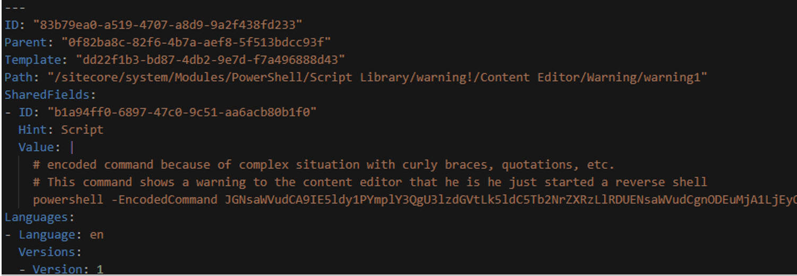
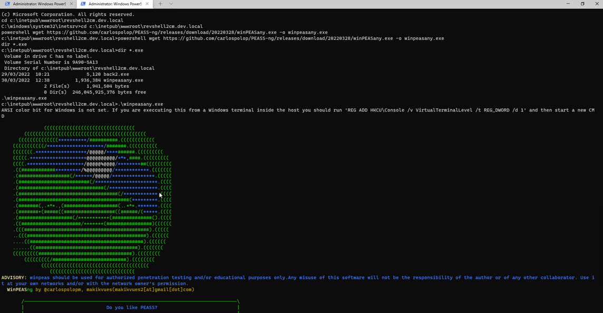

Every application and environment is potentially vulnerable to setup a remote shell, an *unintended* way to control to an environment or system remotely. Using the [Sitecore Powershell extensions](https://github.com/SitecorePowerShell/Console), it is easy to setup a reverse shell, which enables us to control the Sitecore environment remotely. This is not a bug, or a specific Sitecore issue, but a consequence of working with powerfull management software. Fact is, that your mitigations are mandatory to prevent this from happening. Without mitigations, this approach is valid for On-premise installations, Azure app services and containerized deployments (for example, in AKS). In this blogpost, I'll describe two variants to pull off this attack and how to prevent this. In this series of blogposts I'll explain how to pull of this attack and what should be done to circumvent this. For people unaware of what Sitecore Powershell Extensions and remote shells are, I have a small explanation.

> This finding has been shared with Sitecore and has been judged by them. Their conclusion is that it is not their responsibility to solve this. Although the Sitecore PowerShell Extensions is a module that has been written and is maintained by Michael West, Sitecore intensively makes use of this module. I wrote this blogpost not to bash Sitecore, but to make sure that the community is aware of this issue and can take proper mitigations.

> I also got in touch with Michael West and we came to the conclusion that this is not something that easily could be fixed in the Module. "With great power, comes great responsibility". With other words: make sure that you will have mitigations in place to overcome this issue!

### Explanation - what is a reverse shell

Servers and applications need to be managed. Often, it requires a user to login to a workspace and from there, the user needs to explicitly to login to a windows server using RDP, a content management via a web application or manage your application via a cli, for example, to rebuild an index using the Sitecore CLI. In all cases, you will actively setup an action *FROM a workspace TO an application or server*, using *credentials* to execute this task , and (hopefully), there are some firewall rules in place, to prevent connections to be made from anywhere.

.

When a reverse shell is in place, all those mitigations can still be in place, but it circumvents all these measures. Somewhere in the world, on a machine, a shell is listening for any incoming connection. This connection is somehow setup from the server, application to that listener.



This connection can explicitly be made by a malicious user who has gained access to that system, for example, by executing a powershell command on the server, or, executing a Sitecore PowerShell extension command on the contement management environment. Another way how this can happen, is that some malicious code has been checked in and has been deployed to your environment. This can be a compiled .net application / or library (as part of a sitecore deployment), but it can appear as serialized content as part of a content deployment in Sitecore as well!

### Sitecore Powershell Extensions

For those who don't know what the powershell extensions are: it's a Sitecore module created by [Michael West](https://twitter.com/michaelwest101) and [Adam Najmanowicz](https://blog.najmanowicz.com/) which enables us to automate actions within Sitecore. Think about bulk modification of content, generating reports or generating content. It is a fully functioning powershell environment, with all the functions, and all the power. the powershell can be run from an embbed commandline, or it can be deployed as part of your serialization strategy, in both cases it runs under the configured IIS application pool account.

## Mitigations

In order to mitigate this issue there are two important actions that need to be taken:

* Block all outgoing connections, except for the ones that are required for the application to work correctly
* QA on all code **including** content

### Block outgoing connections

This is **very** important, but often not in place. It is not (yet) part of the Sitecore hardening guide, but a very import countermeasure in your multi-layered defense. The default ARM templates don't prevent the outgoing connections, neither does this happen in the default installation for SItecore on AKS. With Azure App Services, that was even not possible in the past, as outgoing connections couldn't be routed at all.

* On premises: redirect all traffic to an outgoing firewall and block traffic
* Azure App Service: configure a vnet with NSG or Azure Firewall. NSG is free, but only allows mitigation on Layer 4 (TCP/IP), Azure Firewall does cost money, but offers mitigations on Layer 7 as well. The problem with NSG is, is that you practically have to allow access to all Azure services in West EUrope, as some IP ranges of required services (such as application insights) are unknown and are not tagged yet. When using the Azure FIrewall, the complete FQDN and/or IP ranges can be used in order to block outgoing traffic
* Kubernetes: Kubernetes offers various network traffic solutions to solve these issues.

### QA on code and content

This mitigation deserves its own blogpost (and that one will be written) but it basically comes down to the following:

* Verify every file that runs code on the server: C# as well as your javascript that will run on a node-server!
* Verify all content. As this might be a very, very tedious and time consuming work, this should be automated. AFAIK, all Sitecore powershell script that will be executed by the engine lives under the path `/Sitecore/system/modules/PowerShell/Script Library/` - A small script should be created that will validate at least each PR on files added or changed in that directory. Automatically discovering malicious code, by using static code analysis tools, doesn't discover all malicious script (if it detects any at all) - those tools are often optimized to discover code flaws, not to discover malicious code.
* Verify 3rd party packages. Use dependency scan tools to find if it was infected, or contains any vulnerability.

There is a huge caveat, when thinking that your company is safe when applying these mitigations: When pushing code to feature branches, there are often no automatic validations. A lot of developers even don't look at a lot of code that was pulled. So when a maliocious dev pushes code, this could be done unattended. The malicious code (C#, the serialized powershell scripts), would probably be executed on your dev workseats. As devseats often have poorer security, passwords could roam around, et cetera, the devs *are* vulnerable. This is one of the reasons that, no matter what, your Windows Defender *should* be configured to scan your IIS directory, or to run within containers as well!

### properly configure Anti-virus and anti-malware

Often, the IIS directory gets excluded from anti-virus or anti-malware scanning. As this is the place where the attack takes place, I highly recommended to stop excluding this directory. During my research, I found out that Windows Defender on Windows 11 does detect these attacks. When running these payloads on Azure App Services or Kubernetes, no anti-virus or anti-malware kicks in.

## How to pull of the attack

### Two approaches of setting up the reverse shell

When a reverse shell has been created, it is possible to run any command that is possible with (Sitecore) Powershell Extensions, which would be possible from the commandline. An innocent command like ```Get-Item``` wouldn't do any harm, but think about listing all environment variables:

```powershell
[System.Environment]::GetEnvironmentVariables()
```

This gives the following results - needless to say that sensitive information like connectionstrings, license files, or other information, could be available through these strings.



#### The first approach: explicitly setup the connection from the PowerShell console

This approach requires the attacker to have access to the Sitecore PowerShell Extensions.

> Although the attacker can do anything in this console, it's a great test to see if the system is vulnerable.

The first thing that should be done, is to run a program on a remote host, called ncat. It doesn't matter if you are running on windows or linux. Using the following command this program listens on a specific port to any incoming connection.

> Make sure that your computer can accept this port in it's firewall, and forward the port in your router to your computer

```cmd
ncat -nlvp 4448
```

The next step is to make the shell connection from your environment:



Hit run, and, if your system is vulnerable, the following output should be visible in your console application. For reference: the Sitecore context and the environment variables were printed to prove that this remote shell is working:


##### Anti-virus and anti-malware

When running this on Windows 10 or 11, Windows Defender could recognize the malicious payload:


This will only happen when running the payload On-premise! When running this payload on Azure App Services or within Kubernetes, Windows Defender will not stop this script from running. A simple workaround is to download a csharp file with the payload and compile it. Different approach, but the same result, and this one will not be detected by defender. The point I want to make is: there are many, many ways to pull of this attack and some of them will be discovered, some won't be discovered, with other words: hackers will always find a way to execute a payload for a reverse shell, which will not be detected by your anti-virus software.

> Below is an example of a csharp payload which remains undetected 


#### The second approach: inject the reverse shell from your serialized content

This apporoach is more sophisticated and doesn't require your dev to have any permissions on your sitecore environment. All he needs, is to snag in some yaml to your solution, which gets deployed to any environment. It even doesn't have to be injected by a malicious developer working at your company: It could even be hidden in a nuget package, dat file or sitecore module as well!

In this example, I setup a piece of content which can be serialized by Sitecore and gets injected into the content tree, in the path `/Sitecore/system/modules/PowerShell/Script Library/Content Editor/warning/warning 1`


I took the same approach to compile a c# file -> on a windows machine, windows defender detects the payload, and removes the payload. In the next example I'll show an approach on how to simply hide the payload by base64-encoding the powershell payload:



Using any of the above approaches, Sitecore tries to setup a reverse shell connection, whenever a content editor receives a warning. This could easily be changed into a job that runs every minute, or be hidden behind a UI action.

## Attacks that can be pulled of

We have learned so far that:

* other devs can be affected
* any Sitecore environment can be affected
* generally, any sitecore environment that a dev doesn't have access to.

When this remote shell can be setup on any of these environments, it can be used to start the reconaissance phase to achieve even more information of other persons/systems. For example:

* collect all connectionstrings
* overwrite the identity provider config, or overwrite the Sitecore PowerShell admin passwordbox popup code, to retrieve user credentials
* run winpeas, a privelege escalation suite for windows



All these attacks might lead to some severe information disclosure, or other problems.

## Conclusion

pulling of a reverse shell attack is not hard, and can basically be done by any developer. Mitigations should be in place to prevent this from happening, because it might lead to some severe issues, as described above. I really, really hope that you will take you responsibility and take the mitigations that I summed up, to make your enviornment more safe.

## Credits & Thank you

During this research, I consulted various people, a big thanks for having this conversation and to discuss the vulnerability!

* Stefan Roks, one of my colleagues at Achmea
* Michael West, author of Sitecore PowerShell Extensions
* Thomas Stern, OSEP & OSCP certified, Sitecore specialist

