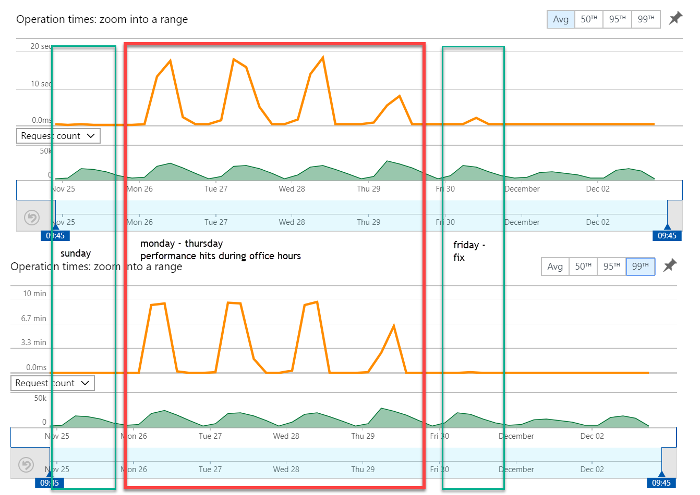
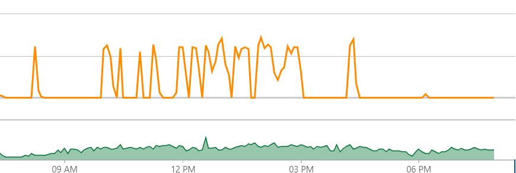

In my [previous blogpost](http://blog.baslijten.com/using-application-insights-annotations-and-how-to-trigger-them-within-your-application/) I described how to create annotations within an application. This blogpost explains how this was integrated in Sitecore and how it could have helped in analyzing our severe performance problems

source can be found [here](https://github.com/BasLijten/sitecore-application-insights-annotations)

Last week, we were facing severe performance issues on our content delivery server on Azure. The CPU was running 100% on certain times, and loadtimes of pages were running up to 10 minutes. The strange part was that this behaviour was quite random (at first). Some moments, the pages were served blazingly fast and other moments it might have been smarter to print the pages, put them into an envlope, and personally deliver them to the person who requested them. By feet.

Our average and 99th percentile overview looked as follows:

It turned out that the performance hits only appeared during business hours. To be specific: the performance problems started to appear around 8:30am and disappeared around 4pm:

## What happened?

The TLDR; It turned out that when the [Url Rewrite](https://github.com/iamandycohen/UrlRewrite) cache is empty, _all requests_ will try to rebuild that cache. This is done using a search query (We use Azure search to be clear), which might throttle if too many clients are trying to use search. In the image below it is clear that often more than 30% of all search queries were throttled.

This lead to longer waiting times and even a lot of redis/session exceptions, in other words: a chain reaction of events happened which caused very strange behaviour.

## The reason behind the empty cache

What was the reason behind the empty cache? THese caches can be flushed manually, or they are emptied after a **_content publish_** And that is exactly what happened throughout the day. Every few minutes, some new content was created and published, which lead to those empty caches, which caused all the requests to try to build up that cache, which lead to "fights" amongst resources. This was for me the reason to add publish annotations to the timeline; everytime a content publish will take place, this will be added to the timeline. When mapping the actual publish actions on the performance timeline, it becomes visible that the publish actions was the reason of the bad performance:

 

## The implementation

The implementation was fairly simple; First, I created the annotation library (as described in my previous blogpost), the second step was to create a publishing processor which gets executed just before the actual publish action:

\[code language="csharp"\] namespace PublishAnnotations.Pipelines.Publishing { public class AnnotatePublishAction : PublishProcessor { public override void Process(PublishContext context) { var client = new TelemetryClient(TelemetryConfiguration.Active);

var dependency = new DependencyTelemetry(); dependency.Name = "Annotate publish action"; dependency.Target = "Application Insights"; dependency.Type = "Http"; var operation = client.StartOperation(dependency);

try { this.AnnotatePublishingAction(); dependency.ResultCode = 200.ToString(); dependency.Success = true;

} catch (Exception e) { dependency.Success = false; client.TrackException(e); } finally { client.StopOperation(operation); } }

public void AnnotatePublishingAction() { var annotation = new Annotations.Annotations(); annotation.CreateAnnotation("Published content", AICategory.Deployment); } } } \[/code\]

## Summary

Publishing actions _might_ have severe implications when there are components in your code which cannot handle these (regular) publishing events too well. That's why we decided to add these annotations to the pipeline, they might have helped us in finding the issue much much faster. In the future, we will loadtest our applications _including_ publication actions and cache flushes, to be sure that these actions will not influence the performance anymore as well.
