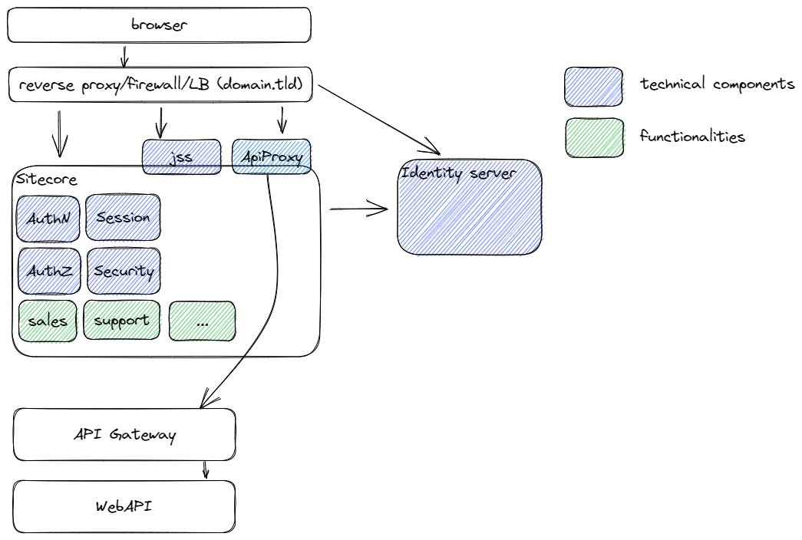
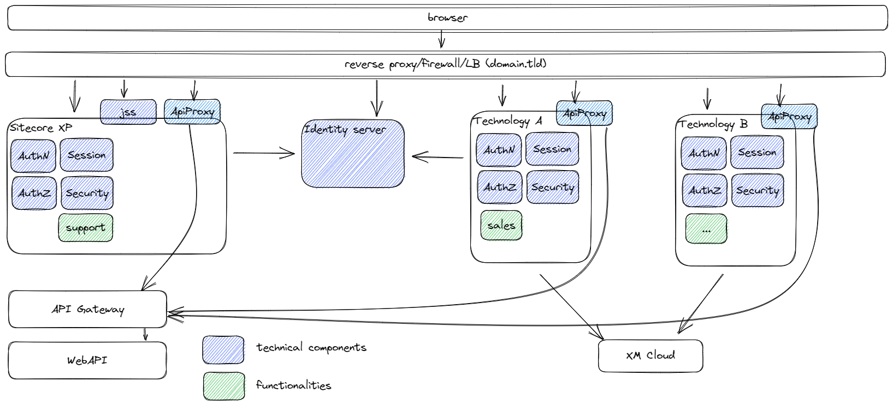
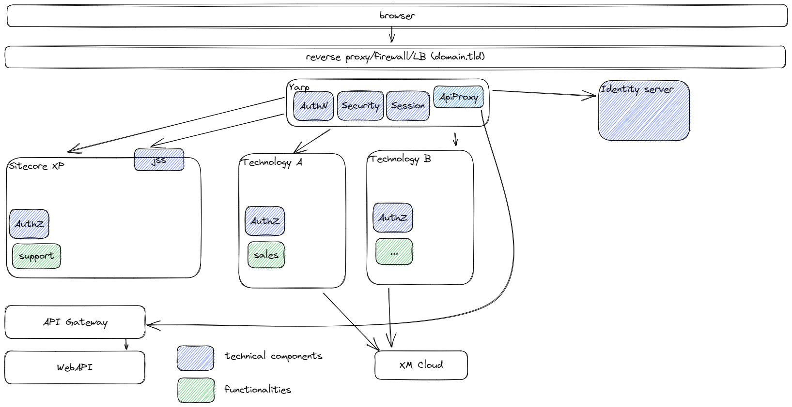

A very short read: This blogpost describes why I am considering to use this [Yarp](https://microsoft.github.io/reverse-proxy/) (Yet another Reverse Proxy) (and a reverse proxy in general) instead of more standard ingress-controllers like HAProxy, Nginx or Traefik for a websites migration usecase. Want to know how I got it to work with Kubernetes in Docker Desktop (KinD)? [Click here](../how-to-deploy-yarp-ingress-controller-on-kubernetes-in-docker-desktop-kind)

In the company I work for, we run Sitecore XP, a .NET 4.8 based CMS, for all of our websites. Sitecore XP is a monolith, which means that all the functionality is bundled in one big application. Think about Authentication Authorization, Security, Session handling, Caching and an WebAPI Proxy (which, as the name suggests, proxies requests to actual WebAPI's). The websites are quite large, consists of server-side rendered MVC pages, and angular based Single Page Applications.

> *Note: the reverse proxy in the image above is not the Yarp reverse proxy, but another top level proxy which handles domains, firewall. Think about azure firewall, F5, whatsoever*

Sitecore is moving towards a more modular, headless architecture, in the form of Sitecore XM Cloud. This basically means that the CMS is being separated from the actual website, and that it doesn't serve functionality for "the head" anymore. Apart from developing one ore more new heads, to serve the webpages, the technical components which reside in Sitecore, which were mentioned before, need to be moved and rebuilded as well. When hosting these components in all of the heads, you will not only end up with (possibly) a lot of duplicate code, redundant functionalities and a lot of maintenance, but when switching from technology stacks, this would mean that you would have to rewrite all of these components as well. **AGAIN**. Apart from the technical implications, this might lead to inconveniences for the end-user. For example, when an endusers switches from using functionality on Sitecore XP to the new head, he or she will have to login again, when the authentication and authorization is not shared between all of the heads.

> *Note: the reverse proxy in the image above is not the Yarp reverse proxy, but another top level proxy which handles domains, firewall. Think about azure firewall, F5, whatsoever*

A logical step would be to have these functionalities in one place, and this is where Yarp comes in. Yarp is a high performance, extensible proxy, written by Microsoft and used on many places within their Azure infrastructure. As it has been written in .Net, it is, for *our company*, very easy to extend, in order to add custom functionality. Without going into too much detail, it offers the possibliltiy to handle authentication challenges in once place, expose the authentication cookie to the end-user, while keeping the jwt-token internally, which can be provided to the websites behind the reverse proxy. While any technology can handle jwt-tokens (as part of the openID protocol), this does not apply to ASP.Net OWIN authentication cookies. They are tied to a framework (.Net) and they are often encrypted with a machine key, so they even cannot be shared between heads based on the same technology stack. And while this might definitely be able with ngnix, haproxy or any other product, we might have more succes with this approach, as we have much in-house knowledge for this language. As seen in the picture below: developers can actually focus on building websites, instead of having to worry about features which do not add any value to the end-user.

## Summary

I tried to explain why we are considering YARP to use as a reverse proxy. I originally wrote this introduction as part of the "how to deploy yarp as an ingress-controller on kubernetes in docker desktop", but I thought it would be better to split it up in two parts, as this introduction might distract from the more technical story I wanted to share.

