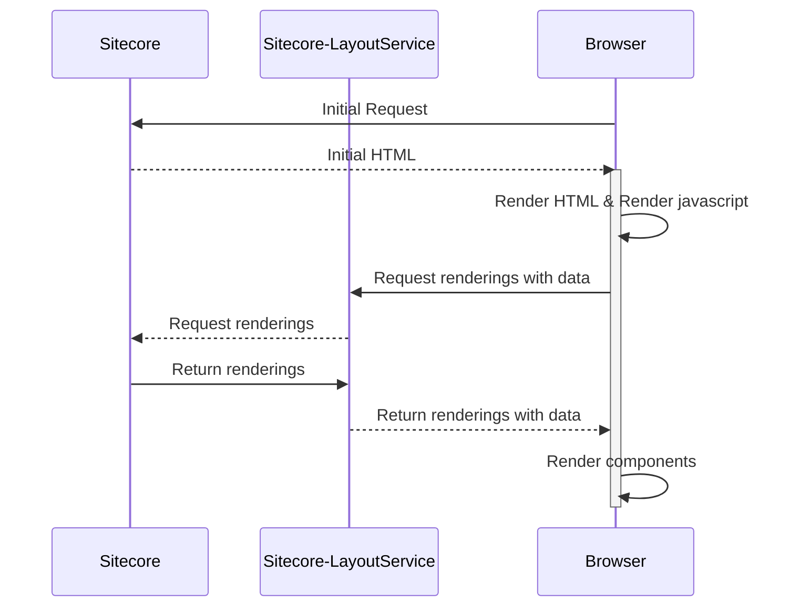

Moving to xmCloud not only brings opportunities, but also challenges. I wrote about it this blogpost in the past: [Why to use YARP in a Sitecore migration](../why-to-choose-yarp-for-a-sitecore-migration/). This blogpost shows how Yarp can aid in reducing the complexity of the migration and how to reduce the effort that is needed, by moving over embedded JSS applications instead of rebuilding them in React. Embedded JSS applications are often used for interactive applications, such as salesfunnels. Building these interactive applicatins often contain (complex) presentation logic, which is expensive to rewrite. When moving from Sitecore XP with angular to Sitecore XM Cloud, you are basically forced to move towards React and NextJS, which implies that a complete rewrite of these applications is mandatory. For a single application a rewrite is not much of a problem, but when talking about hundreds of applications, with millions lines of code, this is a different story.

> Note: This assumes that the JSS application runs fully clientside. Businesslogic is not handled by Sitecore, but by an WebAPI.

## Problems to solve

Before into the details of the solution, two problems are going to be solved:
1) prevent to rewrite the application, as it doesn't offer any business value
2) The JSS Rest layoutservice is not available on the experience edge. Although this can easily be solved within the application, by moving over to the grapqhl endpoint, this will introduce work. Over multiple applications, this adds up: repetitive work, building, testing, depoying, etc.

## Anatomy of an embedded JSS application

An embedded JSS application is a JSS application that is build using the JSS SDK. The initial html is rendered using a regular Sitecore rendering, but the (angular) application itself is rendered clientside. The JSS layoutservice is used to determine what components should be rendered.

The only serverside interaction that the application is depending on, is the initial request to serve the initial HTML. This HTML contains the app wrapper tag to which the app binds to. While being served by Sitecore, this could be served by any other server.

## A mini frontend application

In more conventional Sitecore deployments, the frontend and backend code is being deployed as a monolith. In this approach, the applications will be deployed individually. This could be on azure app services, azure static webapps, within a docker container, it could be served from anywhere. As learned in the previous blogpost, 
